<div align="center">

# PROXMOX

### Informe

**Gabriel Fernando Castillo Mendieta**
**Esteban Nicolás Peña Coronado**
**Luis Javier Lopez Galindo**

**Docente:** Frey Alfonso Santamaría Buitrago
Ingeniero de Sistemas

**Universidad Pedagógica y Tecnológica de Colombia**
Ingeniería de Sistemas y Computación
Electiva IaaS y Virtualización
Tunja
2026

</div>

---

# Informe Tecnico

## TABLA DE CONTENIDOS

- [Requisitos previos](#requisitos-previos)
- [Instalar Proxmox VE en VirtualBox](#instalar-proxmox-ve-en-virtualbox)
- [Crear la máquina virtual](#crear-la-máquina-virtual)
- [Ajustes importantes antes de arrancar](#ajustes-importantes-antes-de-arrancar)
- [Instalar Proxmox](#instalar-proxmox)
- [Introducción (acceso a la GUI)](#introducción-acceso-a-la-gui)
- [Gestión de Usuarios y Permisos (RBAC)](#gestión-de-usuarios-y-permisos-rbac)
- [Crear una Máquina Virtual (KVM)](#crear-una-máquina-virtual-kvm)
- [Crear un Contenedor LXC](#crear-un-contenedor-lxc)
- [Snapshots y Backups](#snapshots-y-backups)
- [Convertir VM en Plantilla y Clonar](#convertir-vm-en-plantilla-y-clonar)
- [Gestión del Ciclo de Vida (CLI)](#gestión-del-ciclo-de-vida-cli)
- [Monitoreo y Firewall](#monitoreo-y-firewall)
- [Tareas y Historial](#tareas-y-historial)
- [Referencias](#referencias)

### LISTA DE FIGURAS

| Figura | Descripción |
|--------|-------------|
| Fg. 1 | Crear VM en VirtualBox |
| Fg. 2 | Habilitar PAE/NX |
| Fg. 3 | Habilitar kVM |
| Fg. 4 | Memoria de video |
| Fg. 5 | Adaptador puente |
| Fg. 6 | Selecciona el disco virtual |
| Fg. 7 | Configuracion proxmox |
| Fg. 8 | asigna una IP estática |
| Fg. 9 | crear grupo usuario |
| Fg. 10 | crear grupo `laboratorio` |
| Fg. 11 | Agregar permisos a grupo |
| Fg. 12 | demostrar permisos limitados |
| Fg. 13 | asiganr nombre a Vm |
| Fg. 14 | seleccionar iso |
| Fg. 15 | configuracion sistema |
| Fg. 16 | configuracion CPU |
| Fg. 17 | configuracion memoria |
| Fg. 18 | configuracion disco |
| Fg. 19 | configuracion red |
| Fg. 20 | consola VM |
| Fg. 21 | escoger plantilla |
| Fg. 22 | Asignar nombre y contraseña |
| Fg. 23 | Seleccionar la plantilla |
| Fg. 24 | configuracion CT |
| Fg. 25 | consola CT |
| Fg. 26 | Snapshot creada |
| Fg. 27 | crear respaldo |
| Fg. 28 | convertir en plantilla |
| Fg. 29 | clonar |
| Fg. 30 | monitoreo |
| Fg. 31 | configuracion firewall |
| Fg. 32 | Historial de tareas |

**Requisitos previos**:

**Instalar Proxmox VE en VirtualBox**

Requisitos previos

- VirtualBox instalado (versión 6.x o 7.x).
- ISO de Proxmox VE descargada desde proxmox.com.
- Al menos 4 GB de RAM y 32 GB de disco disponibles.

1. Crear la máquina virtual

Abre VirtualBox → `Nueva`.
Configura:

- Nombre: `Proxmox`.
- Tipo: `Linux`.
- Versión: `Debian (64-bit)`.
- RAM: mínimo `2048 MB` (recomendado `4096 MB`).
- Disco duro: mínimo `32 GB` (VDI, dinámico).

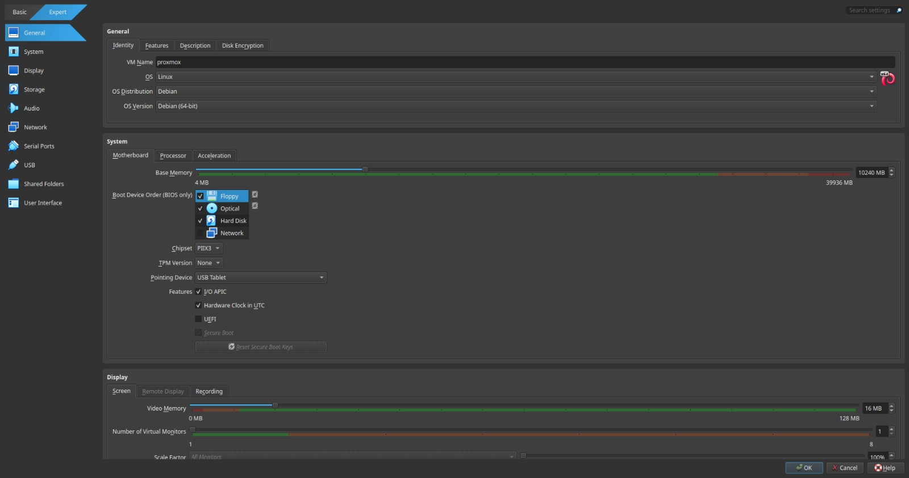

Fg. 1 Crear VM en VirtualBox

2. Ajustes importantes antes de arrancar

Ve a `Configuración` de la VM:

Sistema → Procesador:

- Asigna al menos `2` CPUs.
- Activa "Habilitar PAE/NX".

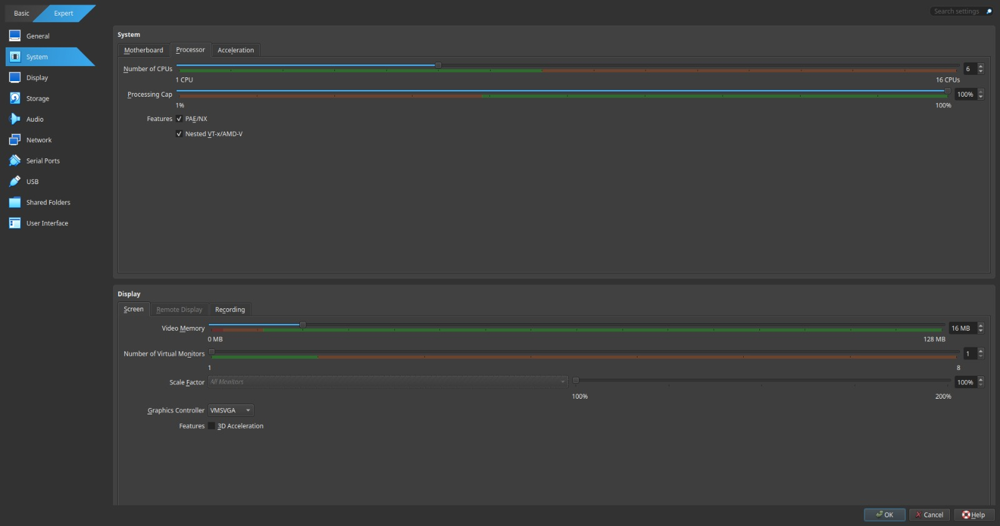

Fg. 2 Habilitar PAE/NX

Sistema → Aceleración:

- Paravirtualización: `KVM` o `Default`.

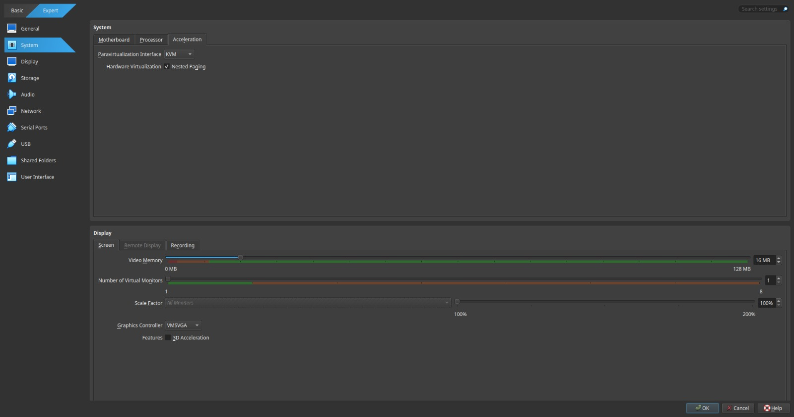

Fg. 3 Habilitar kVM

Pantalla:

- Memoria de vídeo: `16 MB` o más.
  
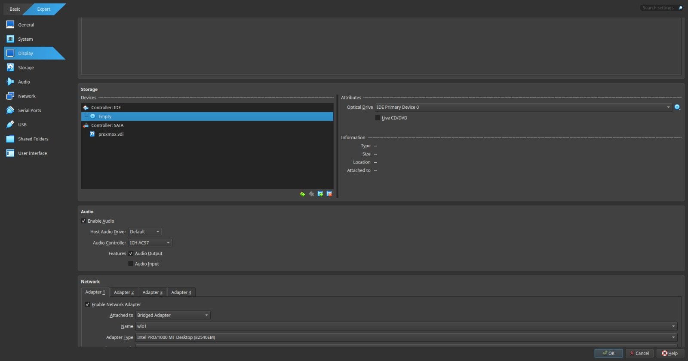

Fg. 4 Memoria de video

Almacenamiento:

- Monta la ISO de Proxmox en la unidad óptica.

Red:

- Adaptador 1: `Adaptador puente (Bridge)` — importante para que Proxmox tenga IP en tu red local.

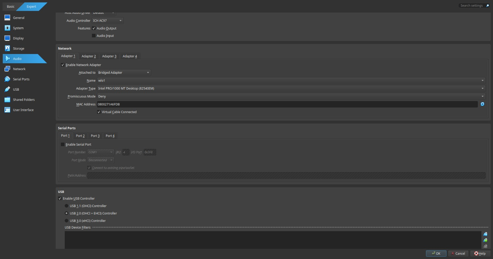

Fg. 5 Adaptador puente

1. Instalar Proxmox

Arranca la VM → selecciona "Install Proxmox VE".
Sigue el instalador:

- Acepta la licencia.
- Selecciona el disco virtual como destino.
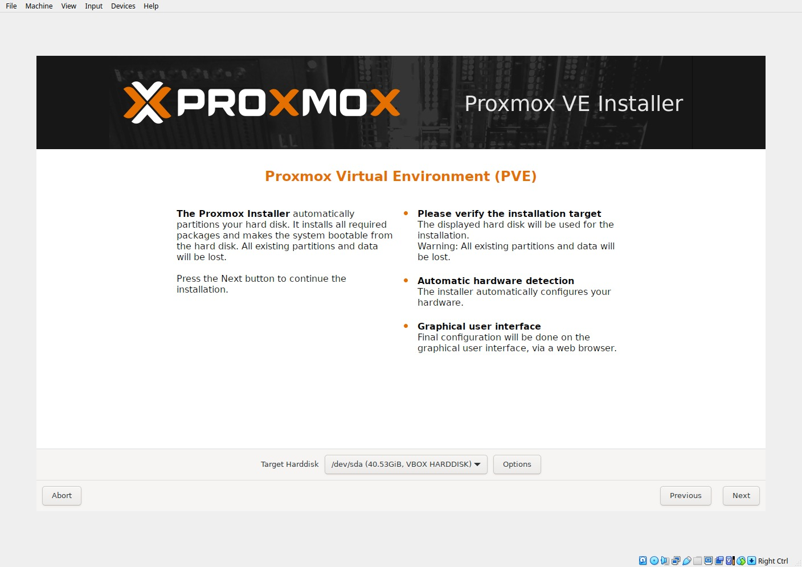

Fg. 6 Captura: Selecciona el disco virtual
- Configura país, zona horaria, teclado.
- Pon una contraseña de `root` y un email.
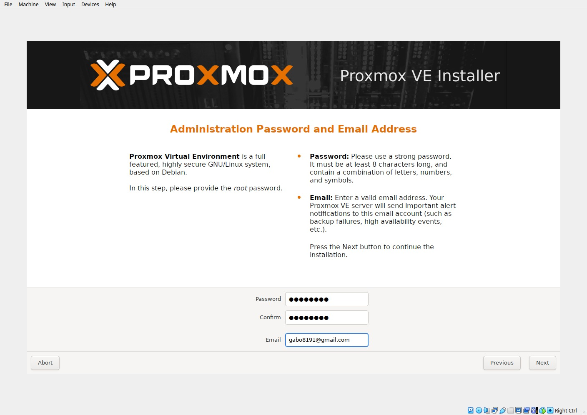

Fg. 7 Captura: Configuracion proxmox
- Red: asigna una IP estática (ej: `192.168.1.200/24`, gateway tu router).
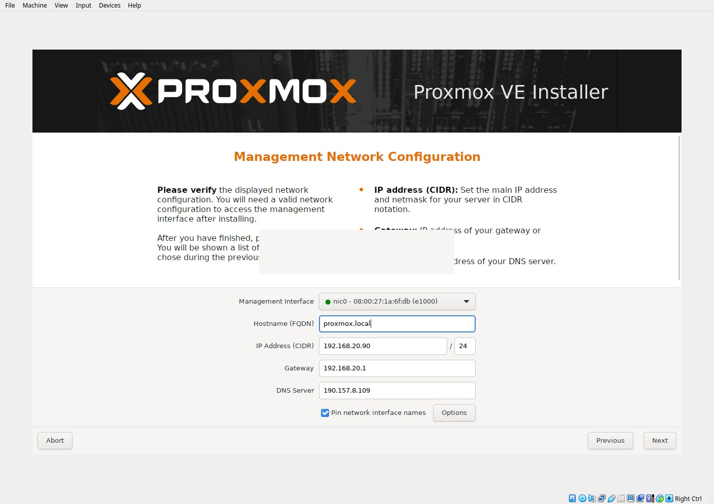

Fg. 8 Captura: asigna una IP estática

**Finalmente :** Completa la instalación y reinicia.

**Introducción (acceso a la GUI)**
- **Abrir:** Navegador → `https://IP-del-servidor:8006`
- **Certificado:** Aceptar advertencia del certificado SSL autofirmado.
- **Login:** Usuario `root`, contraseña definida, seleccionar realm `Linux PAM standard authentication`.
- **Mostrar interfaz:** Resource Tree (izquierda: Datacenter → Nodo → VMs/CTs), panel de métricas en tiempo real (CPU, RAM, red, almacenamiento).

**Gestión de Usuarios y Permisos (RBAC)**
1. Ir a `Datacenter → Permissions → Users`.
2. `Create` → Crear usuario `demo@pve` (realm: `Proxmox VEAuth`). Nota: este usuario solo GUI, sin acceso SSH.
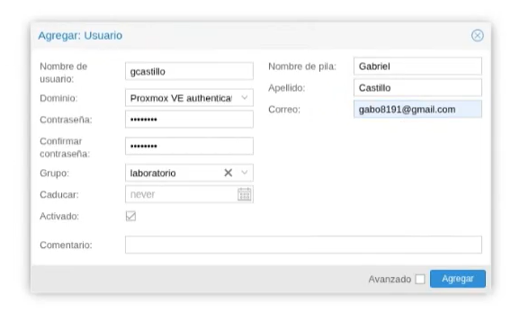

Fg. 9 Captura: crear grupo usuario
3. Ir a `Datacenter → Permissions → Groups` → `Create` → crear grupo `laboratorio`.


Fg. 10 Captura: crear grupo `laboratorio`
4. En la pestaña `Users` del grupo, `Add` → añadir `demo@pve` al grupo `laboratorio`.
5. `Datacenter → Permissions → Add → Group Permission`:
   - Group: `laboratorio`
   - Path: `/vms`
   - Role: `PVEVMAdmin`
   -  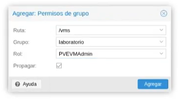

Fg. 11 Captura: Agregar permisos a grupo
6. Cerrar sesión e iniciar sesión con `demo@pve` para demostrar permisos limitados en la GUI.
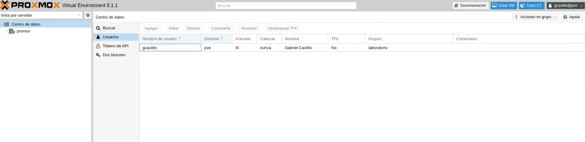

Fg. 12 Captura: demostrar permisos limitados

**Crear una Máquina Virtual (KVM)**
1. `Create VM` (botón arriba derecha).
2. Asignar `VMID` (ej. `101`) y nombre (ej. `vm101-lab`).
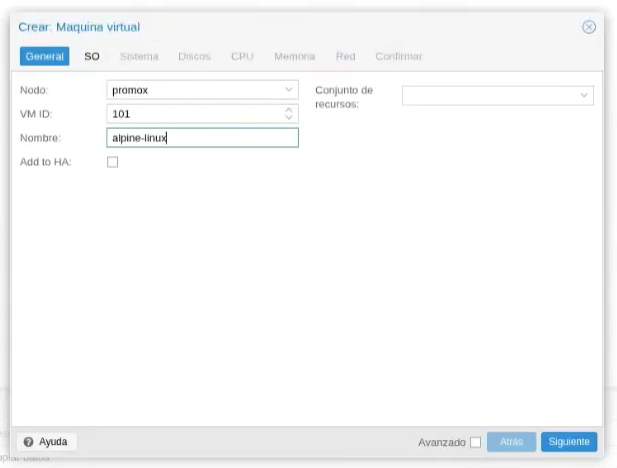

Fg. 13 Captura: asiganr nombre a Vm
3. Pestaña **OS**: seleccionar la ISO subida en `ISO Images`.
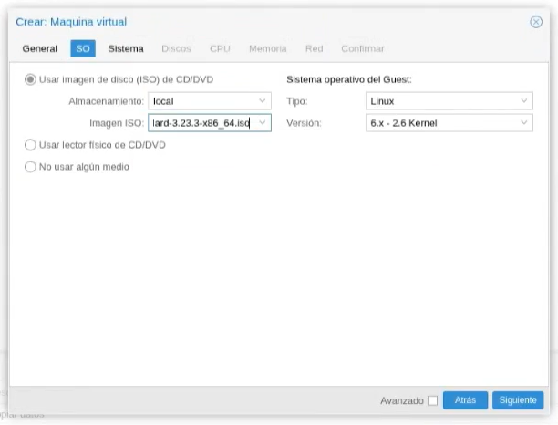

Fg. 14 Captura: seleccionar iso
4. Pestaña **System**: dejar valores por defecto (SeaBIOS o UEFI según preferencia).
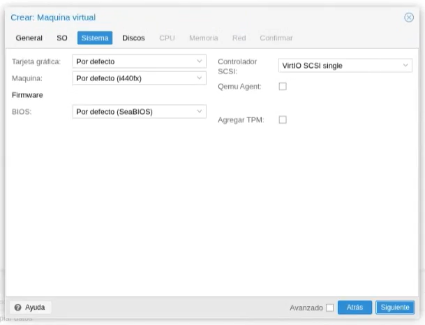

Fg. 15 Captura: configuracion sistema
5. Pestaña **CPU**: asignar `2` cores; tipo de CPU: `x86-64-v2-AES` (recomendado).
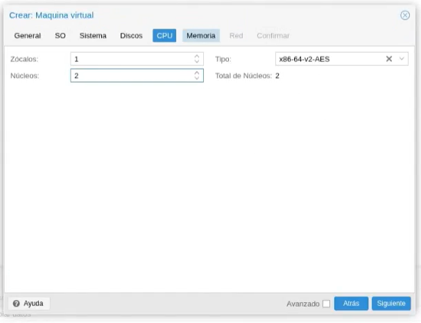

Fg. 16 Captura: configuracion CPU
6. Pestaña **Memory**: `2048 MB`; opcional: activar Ballooning.
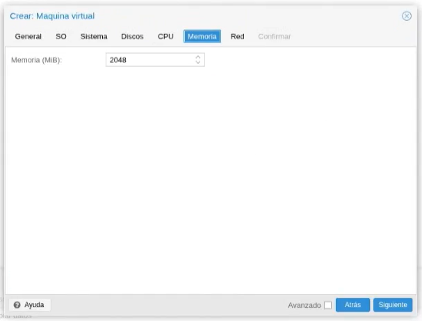

Fg. 17 configuracion memoria
7. Pestaña **Hard Disk**: bus `SCSI` + controladora `VirtIO SCSI`, formato `qcow2`, almacenamiento `local-lvm`, tamaño `20 GB`.
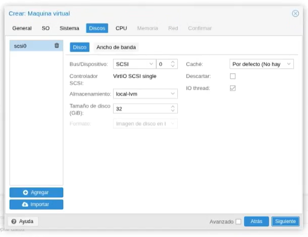

Fg. 18 configuracion disco
8. Pestaña **Network**: modelo `VirtIO`, bridge `vmbr0`.
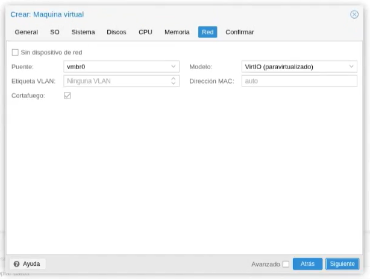

Fg. 19 configuracion red
9.  Finalizar y `Start` para arrancar la VM.
10.  Abrir `Console` (noVNC) desde la pestaña `Console` para mostrar acceso sin cliente adicional.
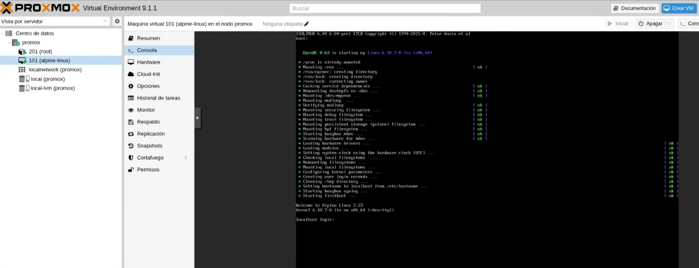

Fg. 20 consola VM

**Crear un Contenedor LXC**
1. Descargar plantilla: ir a almacenamiento local → `CT Templates` → seleccionar y descargar `debian-12-standard`.
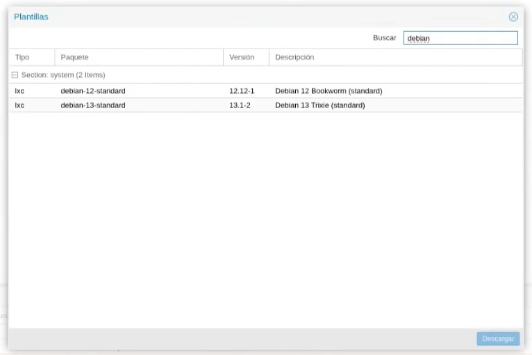

Fg. 21 escoger plantilla
2. Ir a `create CT` , Asignar `CTID` (ej. `201`), nombre y contraseña `root`.
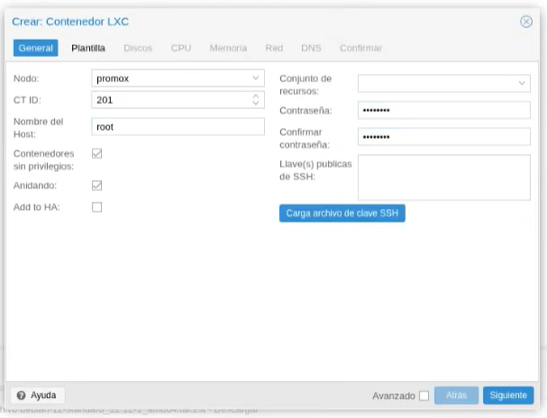

Fg. 22 Asignar nombre y contraseña
3. Seleccionar la plantilla descargada.
   
  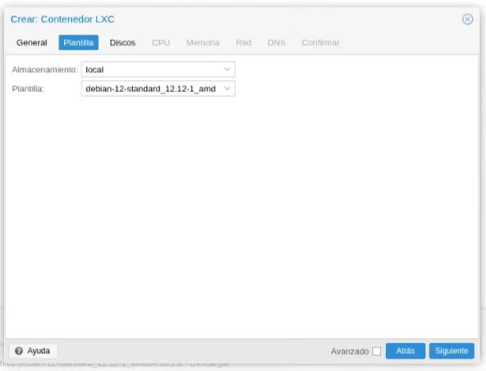

Fg. 23 Seleccionar la plantilla
1. Configurar disco (ej. `8 GB`), CPU (`1` core), RAM (`512 MB`), red (bridge `vmbr0`, IP estática o DHCP).
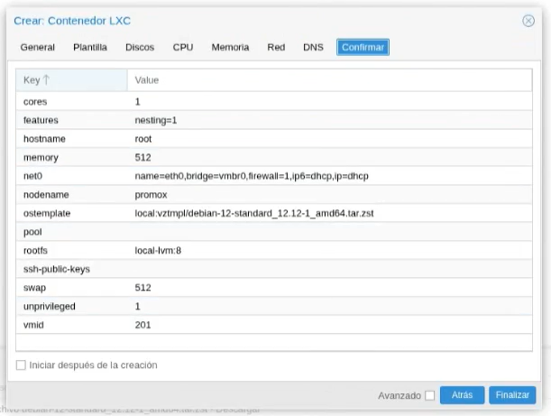

Fg. 24 configuracion CT
1. Importante: dejar activada la opción **Unprivileged container** (recomendada).
2. Finalizar y arrancar el contenedor.
3. Acceder mediante `Console` (xterm.js) — comparar con noVNC: xterm.js es más ligera y orientada a terminales.
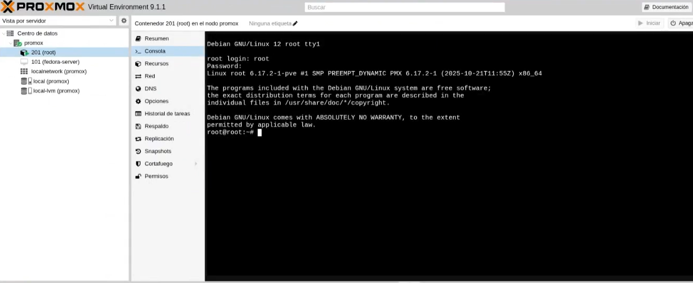

Fg. 25 consola CT

**Snapshots y Backups**
- Snapshots VM:
  1. Seleccionar `VM101` → pestaña `Snapshots`.
  2. `Take Snapshot` → nombre `antes-de-cambios`.
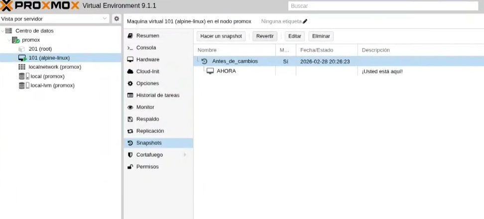

Fg. 26 Snapshot creada
  3. Hacer un cambio dentro de la VM (ej. borrar un archivo) para demostrar reversión.
  4. Restaurar snapshot: seleccionar snapshot → `Rollback`.
- Backups:
  1. Seleccionar VM → pestaña `Backup` → `Backup Now`.
  2. Elegir modo: `snapshot` (sin downtime), `suspend` (pausa breve) o `stop` (apagado limpio).
  3. Seleccionar almacenamiento destino y compresión `zstd`.
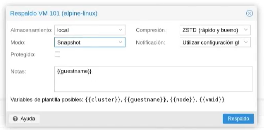

Fg. 27 crear respaldo
  4. Queda un archivo generado `.vma.zst` en el almacenamiento.

**Convertir VM en Plantilla y Clonar**
1. Apagar `VM101`.
2. Click derecho → `Convert to Template` (operación irreversible en esa VM).

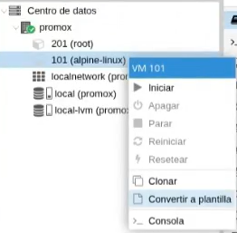

Fg. 28 convertir en plantilla
1. Click derecho en la plantilla → `Clone`.

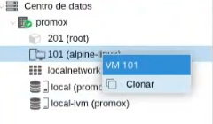

Fg. 29 clonar
1. Opciones de clonación:
   - **Linked Clone**: instantáneo, ocupa poco espacio, depende de la plantilla (ideal para labs).
   - **Full Clone**: copia completa e independiente (ideal para producción).

**Gestión del Ciclo de Vida (CLI)**
Abrir SSH al nodo y ejecutar comandos esenciales:

```
# VMs con qm
qm list
qm start 101
qm shutdown 101
qm snapshot 101 snap1
qm rollback 101 snap1

# Contenedores con pct
pct list
pct start 201
pct stop 201
pct enter 201
```

**Monitoreo y Firewall**
- Ir a `Nodo → Summary`: mostrar gráficas históricas de CPU, RAM, red y almacenamiento en tiempo real.
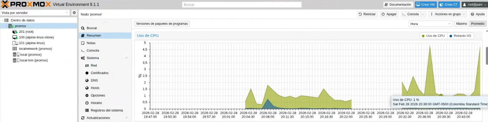

Fg. 30 monitoreo
- Ir a `Datacenter → Firewall`: activarlo y resaltar los tres niveles de firewall (Datacenter → Nodo → VM/CT).
- Agregar una regla de ejemplo para bloquear/permitir un puerto usando una macro (mostrar cómo aplicar y probar).
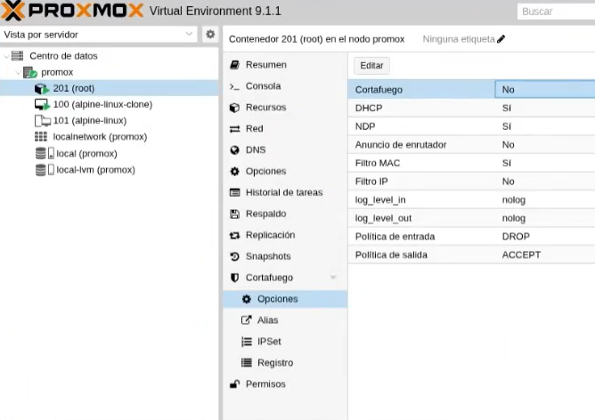

Fg. 31 configuracion firewall

**Tareas y Historial**
- El `Datacenter → Tasks` queda en la parte inferior de la GUI: historial de todas las operaciones realizadas durante la grabación.
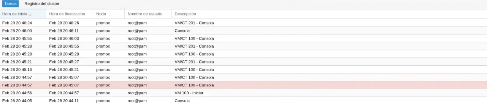

Fg. 32 Historial de tareas


**Referencias**
- Documentación oficial Proxmox VE: https://pve.proxmox.com/wiki/Main_Page