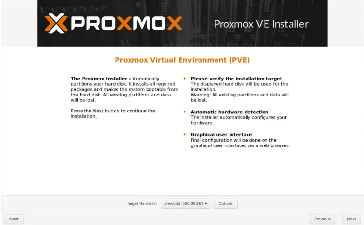
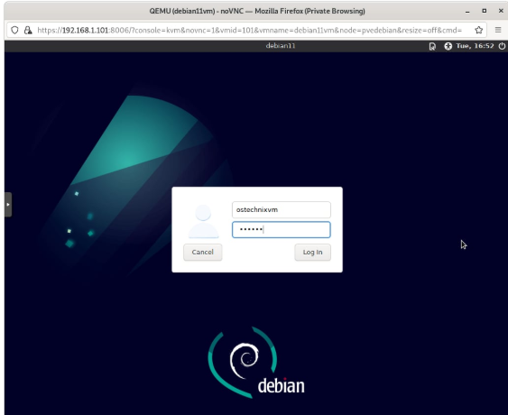
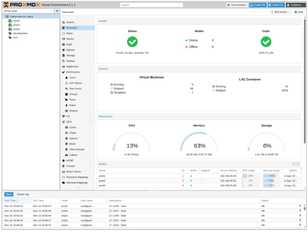
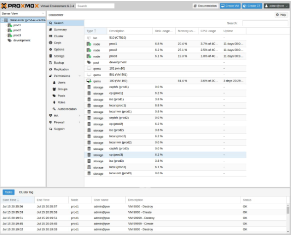
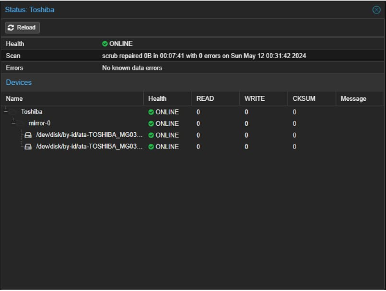
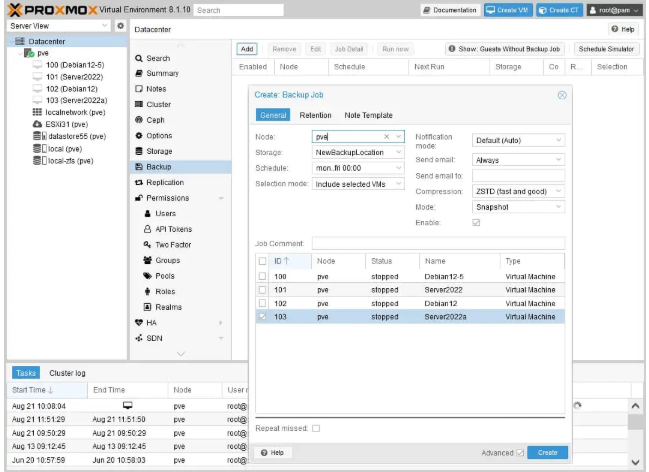
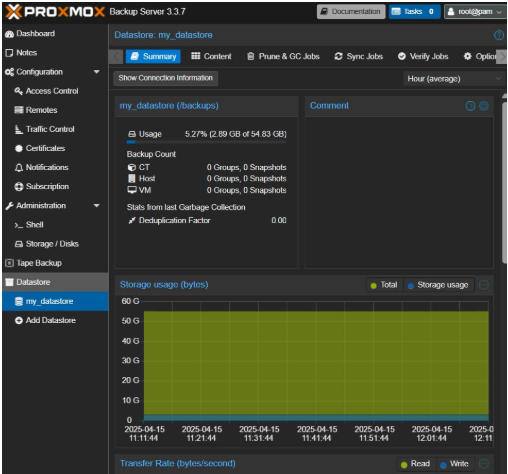
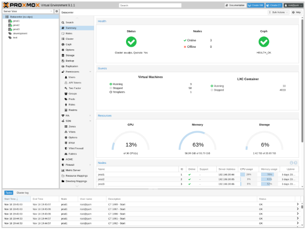

<div align="center">

# PROXMOX

### Informe

**Gabriel Fernando Castillo Mendieta**<br>
**Esteban Nicolás Peña Coronado**<br>
**Luis Javier Lopez Galindo**

**Docente:** Frey Alfonso Santamaría Buitrago
Ingeniero de Sistemas

**Universidad Pedagógica y Tecnológica de Colombia**<br>
Ingeniería de Sistemas y Computación<br>
Electiva IaaS y Virtualización<br>
Tunja<br>
2026

</div>

---

# TABLA DE CONTENIDOS

- [PROXMOX](#proxmox)
    - [Informe](#informe)
- [TABLA DE CONTENIDOS](#tabla-de-contenidos)
- [LISTA DE FIGURAS](#lista-de-figuras)
- [LISTA DE TABLAS](#lista-de-tablas)
  - [1. Arquitectura y Fundamentos](#1-arquitectura-y-fundamentos)
    - [1.1. ¿Qué es Proxmox VE? Definición y casos de uso](#11-qué-es-proxmox-ve-definición-y-casos-de-uso)
    - [1.2. Tipos de hipervisores: Tipo 1 (Bare Metal) ¿dónde encaja Proxmox?](#12-tipos-de-hipervisores-tipo-1-bare-metal-dónde-encaja-proxmox)
    - [1.3. Tecnologías de virtualización integradas](#13-tecnologías-de-virtualización-integradas)
      - [1.3.1. KVM: virtualización completa de hardware](#131-kvm-virtualización-completa-de-hardware)
      - [1.3.2. LXC: contenedores ligeros a nivel de sistema operativo](#132-lxc-contenedores-ligeros-a-nivel-de-sistema-operativo)
      - [1.3.3. Diferencias prácticas: ¿cuándo usar KVM y cuándo LXC?](#133-diferencias-prácticas-cuándo-usar-kvm-y-cuándo-lxc)
    - [1.4. Modelo de licenciamiento: software libre vs. soporte comercial](#14-modelo-de-licenciamiento-software-libre-vs-soporte-comercial)
      - [1.4.1. Licencia de Código Abierto](#141-licencia-de-código-abierto)
      - [1.4.2. Modelo de Soporte Comercial](#142-modelo-de-soporte-comercial)
    - [1.5. Productos disponibles](#15-productos-disponibles)
      - [1.5.1. Proxmox Virtual Environment (Plataforma de Virtualización)](#151-proxmox-virtual-environment-plataforma-de-virtualización)
      - [1.5.2. Proxmox Backup Server (Servidor de Respaldo Empresarial)](#152-proxmox-backup-server-servidor-de-respaldo-empresarial)
      - [1.5.3. Proxmox Mail Gateway (Puerta de Enlace de Correo)](#153-proxmox-mail-gateway-puerta-de-enlace-de-correo)
      - [1.5.4. Proxmox Datacenter Management (Administrador del Centro de Datos](#154-proxmox-datacenter-management-administrador-del-centro-de-datos)
    - [1.6. Novedades en la última versión (v9.1)](#16-novedades-en-la-última-versión-v91)
      - [1.6.1. Creación de Contenedores LXC a Partir de Imágenes OCI](#161-creación-de-contenedores-lxc-a-partir-de-imágenes-oci)
      - [1.6.2. Soporte para Estado de TPM en Formato qcow2](#162-soporte-para-estado-de-tpm-en-formato-qcow2)
      - [1.6.3. Control Granular de Virtualización Anidada](#163-control-granular-de-virtualización-anidada)
      - [1.6.4. Reporte Mejorado de Estado de SDN](#164-reporte-mejorado-de-estado-de-sdn)
      - [1.6.5. Kernel Linux 6.17 y Debian 13.2 Trixie](#165-kernel-linux-617-y-debian-132-trixie)
      - [1.6.6. Infraestructura General de Versión 9.1](#166-infraestructura-general-de-versión-91)
  - [2. Instalación y Primeros Pasos](#2-instalación-y-primeros-pasos)
    - [2.1. Requisitos de hardware recomendados](#21-requisitos-de-hardware-recomendados)
    - [2.2. Proceso de instalación desde ISO](#22-proceso-de-instalación-desde-iso)
    - [2.3. Acceso a la GUI Web (HTTPS, puerto 8006)](#23-acceso-a-la-gui-web-https-puerto-8006)
    - [2.4. Visión general de la interfaz: Datacenter, Nodos, VMs y Contenedores](#24-visión-general-de-la-interfaz-datacenter-nodos-vms-y-contenedores)
    - [2.5. Actualización del sistema y gestión de repositorios (Community vs. Enterprise)](#25-actualización-del-sistema-y-gestión-de-repositorios-community-vs-enterprise)
    - [2.6. Primeras configuraciones: hostname, red de gestión, DNS y NTP](#26-primeras-configuraciones-hostname-red-de-gestión-dns-y-ntp)
  - [3. Gestión de Almacenamiento](#3-gestión-de-almacenamiento)
    - [3.1. Almacenamiento Local](#31-almacenamiento-local)
      - [3.1.1. Directorios (Directory): el tipo más simple, basado en sistema de ficheros](#311-directorios-directory-el-tipo-más-simple-basado-en-sistema-de-ficheros)
      - [3.1.2. LVM y LVM-Thin: gestión de volúmenes lógicos y thin provisioning](#312-lvm-y-lvm-thin-gestión-de-volúmenes-lógicos-y-thin-provisioning)
      - [3.1.3. ZFS: sistema de archivos avanzado con checksums, snapshots nativos y RAID por software](#313-zfs-sistema-de-archivos-avanzado-con-checksums-snapshots-nativos-y-raid-por-software)
    - [3.2. Almacenamiento Compartido](#32-almacenamiento-compartido)
      - [3.2.1. NFS: almacenamiento en red basado en ficheros](#321-nfs-almacenamiento-en-red-basado-en-ficheros)
  - [4. Redes Virtuales](#4-redes-virtuales)
    - [4.1. Conceptos base: interfaces físicas y VLAN](#41-conceptos-base-interfaces-físicas-y-vlan)
    - [4.2. Linux Bridge: el estándar por defecto en Proxmox y su configuración](#42-linux-bridge-el-estándar-por-defecto-en-proxmox-y-su-configuración)
    - [4.3. ¿Qué es el módulo SDN de Proxmox?](#43-qué-es-el-módulo-sdn-de-proxmox)
  - [5. Creación y Gestión de VMs y Contenedores](#5-creación-y-gestión-de-vms-y-contenedores)
    - [5.1. Creación de una VM KVM: opciones de CPU, memoria, disco y red](#51-creación-de-una-vm-kvm-opciones-de-cpu-memoria-disco-y-red)
    - [5.2. Plantillas de VM y clonación (linked clone vs. full clone)](#52-plantillas-de-vm-y-clonación-linked-clone-vs-full-clone)
    - [5.3. Creación de contenedores LXC: descarga de plantillas del repositorio](#53-creación-de-contenedores-lxc-descarga-de-plantillas-del-repositorio)
    - [5.4. Gestión del ciclo de vida: arranque, pausa, apagado, reinicio y eliminación](#54-gestión-del-ciclo-de-vida-arranque-pausa-apagado-reinicio-y-eliminación)
  - [6. Continuidad y Respaldos](#6-continuidad-y-respaldos)
    - [6.1. Protección del Dato](#61-protección-del-dato)
      - [6.1.1. Snapshots (instantáneas): creación, restauración y gestión](#611-snapshots-instantáneas-creación-restauración-y-gestión)
    - [6.2. Copias de Seguridad](#62-copias-de-seguridad)
      - [6.2.1. Backup integrado en Proxmox VE: modos vzdump (snapshot, suspend, stop)](#621-backup-integrado-en-proxmox-ve-modos-vzdump-snapshot-suspend-stop)
      - [6.2.2. Tareas de backup programadas y su configuración](#622-tareas-de-backup-programadas-y-su-configuración)
  - [7. Seguridad y Administración](#7-seguridad-y-administración)
    - [7.1. Control de Acceso](#71-control-de-acceso)
      - [7.1.1. RBAC: usuarios, grupos y roles predefinidos en Proxmox](#711-rbac-usuarios-grupos-y-roles-predefinidos-en-proxmox)
      - [7.1.2. Dominios de autenticación: Proxmox VE Auth y Linux PAM](#712-dominios-de-autenticación-proxmox-ve-auth-y-linux-pam)
    - [7.2. Interfaces de Administración](#72-interfaces-de-administración)
      - [7.2.1. GUI Web: navegación y tareas comunes](#721-gui-web-navegación-y-tareas-comunes)
      - [7.2.2. CLI: comandos qm y pct](#722-cli-comandos-qm-y-pct)
    - [7.3. Firewall Integrado](#73-firewall-integrado)
      - [7.3.1. Arquitectura del firewall: niveles Datacenter, Nodo y VM/Contenedor](#731-arquitectura-del-firewall-niveles-datacenter-nodo-y-vmcontenedor)
      - [7.3.2. Grupos de seguridad y macros predefinidas](#732-grupos-de-seguridad-y-macros-predefinidas)
    - [7.4. Alta Disponibilidad (HA)](#74-alta-disponibilidad-ha)
      - [7.4.1. HA Manager: monitoreo y recuperación automática de VMs/contenedores](#741-ha-manager-monitoreo-y-recuperación-automática-de-vmscontenedores)
  - [8. Consolas y Conexión a Instancias](#8-consolas-y-conexión-a-instancias)
    - [8.1. Consola noVNC: acceso web sin cliente adicional](#81-consola-novnc-acceso-web-sin-cliente-adicional)
    - [8.2. xterm.js: terminal ligera para contenedores y VMs Linux](#82-xtermjs-terminal-ligera-para-contenedores-y-vms-linux)
    - [8.3. Acceso SSH directo al nodo y a los contenedores](#83-acceso-ssh-directo-al-nodo-y-a-los-contenedores)
  - [9. Monitoreo Básico](#9-monitoreo-básico)
    - [9.1. Monitoreo de recursos en la GUI: CPU, RAM, red y almacenamiento ,Logs del sistema y del clúster](#91-monitoreo-de-recursos-en-la-gui-cpu-ram-red-y-almacenamiento-logs-del-sistema-y-del-clúster)
  - [REFERENCIAS BIBLIOGRÁFICAS](#referencias-bibliográficas)

---

# LISTA DE FIGURAS

| Figura | Descripción |
|--------|-------------|
| Fg. 1 | Vista de instalación de Proxmox [47] |
| Fg. 2 | Log In en la MV [48] |
| Fg. 3 | Vista de la interfaz de Proxmox [47] |
| Fg. 4 | GUI de Proxmox Virtual Environment [17] |
| Fg. 5 | Presentación de volúmenes y estado de disco [23] |
| Fg. 6 | Presentación de volúmenes y estado de disco [41] |
| Fg. 7 | Uso y gestión de un datastore en Proxmox [42] |
| Fg. 8 | GUI de administración de Proxmox VE (Vista Datacenter y Nodo) [50] |

---

# LISTA DE TABLAS

| Tabla | Descripción |
|-------|-------------|
| Tabla 1 | Comparación entre hipervisores de Tipo 1 y Tipo 2 |
| Tabla 2 | Comparación detallada entre KVM y LXC en Proxmox VE |
| Tabla 3 | Requisitos mínimos y recomendados para Proxmox |
| Tabla 4 | Características de LVM Clásico y LVM-Thin |
| Tabla 5 | Parámetros clave de configuración del Linux Bridge en Proxmox VE |
| Tabla 6 | Comparación entre Linked Clone y Full Clone en Proxmox VE |
| Tabla 7 | Modos de acuerdo al huésped y comportamientos e implicaciones |
| Tabla 8 | Roles predefinidos en Proxmox VE |
| Tabla 9 | Comparativa entre dominios de autenticación en Proxmox VE |
| Tabla 10 | Comparación general entre acceso noVNC y cliente VNC externo |
| Tabla 11 | Comparación funcional entre noVNC y xterm.js |

---

Proxmox Virtual Environment (Proxmox VE) es una plataforma de virtualización de servidores de código abierto basada en Debian GNU/Linux que combina dos tecnologías de virtualización líderes para ofrecer una solución integral de gestión de infraestructura. Desarrollada por Proxmox Server Solutions GmbH, una empresa austriaca fundada en 2005, esta plataforma ha ganado tracción significativa en el mercado empresarial como alternativa rentable a soluciones propietarias de virtualización[1]. Con más de 1,6 millones de hosts desplegados a nivel mundial y una comunidad activa de más de 225.000 miembros en su foro de soporte, Proxmox VE se ha convertido en una solución preferida para

organizaciones que buscan independencia de proveedor y control total sobre su infraestructura de virtualización[2].

## 1. Arquitectura y Fundamentos
### 1.1. ¿Qué es Proxmox VE? Definición y casos de uso
Proxmox Virtual Environment es una plataforma completa diseñada para ejecutar máquinas virtuales y contenedores en una única solución integrada[3]. Se trata de un hipervisor de Tipo 1 o bare-metal que opera directamente sobre el hardware físico, proporcionando una capa de abstracción mínima entre los recursos de computación y las máquinas virtuales o contenedores hospedados[1]. Esta arquitectura fundamental permite que Proxmox VE ofrezca rendimiento superior y mejor aislamiento de seguridad en comparación con los hipervisores de Tipo 2, que requieren un sistema operativo host preexistente.
La plataforma ofrece una interfaz de gestión unificada basada en web que simplifica significativamente las tareas administrativas. Un objetivo de diseño fundamental fue hacer que la administración fuera lo más fácil posible, permitiendo que incluso usuarios novatos puedan configurar e instalar Proxmox VE en cuestión de minutos[3]. Esto contrasta con las soluciones de virtualización tradicionales que requieren herramientas de gestión separadas, complejas y costosas. Los casos de uso primarios de Proxmox VE incluyen: consolidación de servidores en centros de datos, creación de infraestructuras hiperconvergidas, implementación de entornos de nube privada, backup y recuperación de desastres, así como virtualización de escritorio y servidores de aplicaciones[2]. La flexibilidad de la plataforma la hace adecuada tanto para pequeñas empresas como para grandes corporaciones con miles de máquinas virtuales.

### 1.2. Tipos de hipervisores: Tipo 1 (Bare Metal) ¿dónde encaja Proxmox?
Para comprender la arquitectura de Proxmox VE, es esencial conocer la clasificación de los hipervisores en dos categorías principales. Los hipervisores de Tipo 1, también conocidos como bare-metal hypervisors, se ejecutan directamente en el hardware físico sin necesidad de un sistema operativo host intermedio[4]. Este diseño proporciona acceso directo a los recursos del hardware y minimiza la sobrecarga operativa, resultando en mejor rendimiento y seguridad.
Los hipervisores de Tipo 2, por el contrario, se ejecutan sobre un sistema operativo existente, actuando como una aplicación más del sistema. Aunque ofrecen mayor flexibilidad en algunos escenarios de desarrollo, sufren de sobrecarga adicional debida a la capa del sistema operativo host y generalmente no se recomiendan para entornos de producción de alto rendimiento.
Proxmox VE es definitivamente un hipervisor de Tipo 1. Aunque el proyecto comenzó originalmente basándose en Debian GNU/Linux, la arquitectura final de Proxmox VE funciona como un hipervisor baremetal que se instala directamente sobre hardware sin requerir un sistema operativo host separado[1]. La distinción clave radica en que Proxmox VE toma el kernel de Linux y lo convierte en el hipervisor mismo, en lugar de ejecutarse como una aplicación dentro de Linux.

Esta característica fundamental proporciona a Proxmox VE las ventajas de rendimiento y aislamiento asociadas con los hipervisores de Tipo 1.

Tabla 1
Comparación entre hipervisores de Tipo 1 y Tipo 2

<table>
<thead>
<tr>
<th>Característica</th>
<th>Tipo 1 (Bare Metal)</th>
<th>Tipo 2 (Hosted)</th>
</tr>
</thead>
<tbody>
<tr>
<td>Ubicación</td>
<td>Se ejecuta directamente en hardware</td>
<td>Se ejecuta sobre un SO anfitrión</td>
</tr>
<tr>
<td>Rendimiento</td>
<td>Rendimiento máximo, mínima sobrecarga</td>
<td>Rendimiento reducido por capa SO</td>
</tr>
<tr>
<td>Seguridad</td>
<td>Aislamiento de hardware robusto</td>
<td>Seguridad dependiente del SO anfitrión</td>
</tr>
<tr>
<td>Acceso Recursos</td>
<td>Acceso directo al hardware</td>
<td>Acceso mediado por SO anfitrión</td>
</tr>
<tr>
<td>Ejemplo</td>
<td>Proxmox VE, VMware ESXi, Hyper-V</td>
<td>VMware Workstation, VirtualBox</td>
</tr>
<tr>
<td>Uso Recomendado</td>
<td>Producción empresarial</td>
<td>Desarrollo y laboratorios</td>
</tr>
</tbody>
</table>

Nota. Elaboración propia a partir de [1].

### 1.3. Tecnologías de virtualización integradas
#### 1.3.1. KVM: virtualización completa de hardware
Kernel-based Virtual Machine (KVM) es una tecnología de virtualización que transforma un kernel de Linux en un hipervisor completo[5]. Técnicamente, KVM es un módulo del kernel que permite que Linux actúe como hipervisor, proporcionando virtualización acelerada por hardware de CPU y memoria. Esta arquitectura única permite que Proxmox VE combine las ventajas del kernel de Linux con las capacidades de virtualización de hardware.
KVM funciona mediante la virtualización completa de hardware, lo que significa que proporciona una emulación completa de un sistema informático físico. Esto permite que máquinas virtuales ejecuten sistemas operativos completamente diferentes del host, incluyendo Windows, Linux, BSD, macOS y otros sistemas operativos de propósito general[5]. Cada máquina virtual tiene su propio kernel del sistema operativo, sus propias interfaces de dispositivos virtuales y su propio espacio de memoria dedicado.
En Proxmox VE, QEMU (Quick EMUlator) trabaja en conjunto con KVM. QEMU maneja la emulación de dispositivos como discos virtuales y tarjetas de red, gestiona la entrada/salida de la máquina virtual, mientras que KVM proporciona la aceleración de hardware para CPU y memoria[1]. Esta combinación KVM+QEMU proporciona un rendimiento de clase empresarial similar al de hipervisores baremetal especializados.
Las ventajas clave de KVM incluyen aislamiento completo entre máquinas virtuales, seguridad robusta debido a la separación de hardware, flexibilidad para

ejecutar múltiples sistemas operativos, y actualizaciones de seguridad que se benefician de toda la comunidad de Linux. Sin embargo, KVM requiere más recursos que los contenedores LXC debido al overhead de virtualizar hardware completo, lo que resulta en mayores requisitos de memoria y almacenamiento.

#### 1.3.2. LXC: contenedores ligeros a nivel de sistema operativo
Linux Containers (LXC) representa un enfoque fundamentalmente diferente a la virtualización, basado en la virtualización a nivel del sistema operativo en lugar de la emulación completa de hardware[6]. LXC proporciona aislamiento de procesos mediante namespaces del kernel de Linux y control de grupos (cgroups), permitiendo que múltiples entornos de contenedores compartan el mismo kernel del host mientras mantienen la ilusión de un sistema operativo completo independiente.
Los contenedores LXC son significativamente más ligeros que las máquinas virtuales. Un contenedor LXC inactivo típicamente consume solo 100-200 MB de RAM, comparado con varios gigabytes requeridos por una máquina virtual[6].
Este uso eficiente de recursos LXC: Contenedores Ligeros a Nivel de Sistema Operativo permite a los administradores desplegar muchos más contenedores en el mismo hardware físico.
El rendimiento de LXC es casi indistinguible del rendimiento nativo, sin la sobrecarga de virtualización inherente a KVM. Las aplicaciones dentro de contenedores LXC se ejecutan a velocidad casi de baremetal, lo que los hace ideales para cargas de trabajo sensibles al rendimiento como bases de datos y servidores web[6]. Esta eficiencia hace que LXC sea la opción preferida para microservicios, desarrollo rápido y entornos de alta densidad.
Sin embargo, LXC tiene restricciones importantes. Debido a que todos los contenedores comparten el kernel del host, están limitados a ser sistemas basados en Linux. No es posible ejecutar Windows, BSD o macOS en un contenedor LXC[6]. Además, aunque las características de seguridad del kernel moderno son robustas, el aislamiento no es absoluto; una vulnerabilidad crítica a nivel de kernel podría teóricamente comprometer todos los contenedores en el host.

#### 1.3.3. Diferencias prácticas: ¿cuándo usar KVM y cuándo LXC?
La elección entre KVM y LXC depende de los requisitos específicos de la carga de trabajo. La siguiente tabla presenta un análisis comparativo detallado de estos dos enfoques:

Tabla 2
Comparación detallada entre KVM y LXC en Proxmox VE

<table>
<thead>
<tr>
<th>Característica</th>
<th>KVM</th>
<th>LXC</th>
<th>Veredicto</th>
</tr>
</thead>
<tbody>
<tr>
<td>Rendimiento</td>
<td>Bueno, con overhead de virtualización</td>
<td>Excelente, velocidad near bare-metal</td>
<td>LXC</td>
</tr>
<tr>
<td>Uso de Recursos</td>
<td>Alto, requiere RAM y disco reservados</td>
<td>Muy bajo, mínimo RAM y disco</td>
<td>LXC</td>
</tr>
<tr>
<td>Aislamiento y Seguridad</td>
<td>Excelente, aislamiento de hardware</td>
<td>Bueno, pero kernel compartido</td>
<td>KVM</td>
</tr>
<tr>
<td>Compatibilidad SO</td>
<td>Windows, Linux, BSD, macOS, etc.</td>
<td>Solo Linux</td>
<td>KVM</td>
</tr>
<tr>
<td>Tiempo de Arranque</td>
<td>Más lento, completa inicialización SO</td>
<td>Muy rápido, segundos</td>
<td>LXC</td>
</tr>
<tr>
<td>Densidad de Máquinas</td>
<td>Baja-Media</td>
<td>Alta</td>
<td>LXC</td>
</tr>
<tr>
<td>Casos de Uso</td>
<td>Desarrollo, testing, apps heterogéneas</td>
<td>Microservicios, apps Linux</td>
<td>Depende</td>
</tr>
</tbody>
</table>

Nota. Elaboración propia a partir de [5][6].

Para cargas de trabajo que requieren máxima seguridad y aislamiento, como ejecutar aplicaciones de terceros no confiables o consolidar sistemas que requieren seguridad de banco, KVM es la opción apropiada. Su aislamiento completo de hardware garantiza que un compromiso en una máquina virtual no pueda afectar otras máquinas virtuales o el host[5].
Para aplicaciones nativas de Linux que necesitan alta densidad y máximo rendimiento, como servidores web, caches Redis, bases de datos Elasticsearch, o microservicios containerizados, LXC es la opción óptima. La eficiencia de recursos y el rendimiento excepcional hacen que LXC sea ideal para escalabilidad horizontal[6].
En muchos casos, una estrategia híbrida es la más apropiada: utilizar LXC para la mayoría de cargas de trabajo Linux estándar y reservar KVM para casos especiales que requieran diferentes sistemas operativos o máxima seguridad de aislamiento.

### 1.4. Modelo de licenciamiento: software libre vs. soporte comercial

#### 1.4.1. Licencia de Código Abierto
Proxmox Virtual Environment está disponible bajo la licencia GNU Affero General Public License v3.0 (AGPLv3), una licencia de código abierto permisiva pero con requisitos de reciprocidad[2]. Esta licencia garantiza que el código fuente es completamente accesible, auditable y modificable por cualquier usuario u organización. No existen restricciones de funcionalidad basadas en licencias: la versión de código abierto incluye todas las características completas del producto, incluyendo clustering, alta disponibilidad, copias de seguridad integradas y todas las capacidades de gestión[7]

#### 1.4.2. Modelo de Soporte Comercial
Aunque el software en sí es completamente gratuito, Proxmox Server Solutions GmbH ofrece suscripciones de soporte comercial para organizaciones que requieren asistencia profesional, actualizaciones garantizadas y acceso a repositorios estables. Este modelo es común en proyectos de código abierto exitosos y permite a los desarrolladores del proyecto asegurar financiamiento para mejoras continuas[2].

Las opciones de suscripción disponibles incluyen:
*   Community Edition: Acceso gratuito a la rama Community del repositorio, acceso a soporte comunitario a través del foro de Proxmox con miles de usuarios activos, y todas las características del producto. Esta es la opción adecuada para laboratorios, pruebas y despliegues no críticos[7].
*   Suscripción Enterprise: Comenzando desde EUR 115 por año por CPU, proporciona acceso al repositorio Enterprise con actualizaciones rígidamente probadas y estables, acceso garantizado a soporte técnico certificado de los desarrolladores de Proxmox con tiempos de respuesta garantizados, acceso al Proxmox Customer Portal, y se recomienda para ambientes de producción[2].
*   Suscripciones Escalonadas: Proxmox ofrece suscripciones Basic, Standard y Premium con diferentes niveles de soporte y tiempos de respuesta garantizados, permitiendo que las organizaciones seleccionen el nivel de apoyo que corresponde a sus necesidades y presupuesto.

Es importante notar que no hay versión "freemium" de Proxmox VE. La versión comunitaria gratuita incluye toda la funcionalidad; no hay características ocultas o limitadas para incentivar la compra de suscripciones. El valor de la suscripción radica únicamente en el soporte profesional y el acceso a repositorios curados[7].

### 1.5. Productos disponibles

#### 1.5.1. Proxmox Virtual Environment (Plataforma de Virtualización)
Proxmox VE es el producto principal y más completo, sirviendo como plataforma central de virtualización. Este producto integra todas las tecnologías descritas anteriormente: virtualización KVM, contenedores LXC, herramientas de almacenamiento definido por software (incluyendo soporte nativo para Ceph y ZFS), y redes definidas por software (SDN)[3]. La interfaz web centralizada permite la gestión de múltiples nodos, clusters de alta disponibilidad, y miles de máquinas virtuales y contenedores desde una única consola.

#### 1.5.2. Proxmox Backup Server (Servidor de Respaldo Empresarial)
Proxmox Backup Server es una solución de respaldo empresarial dedicada, escrita en el lenguaje de programación Rust para máximo rendimiento y seguridad[2]. Este producto está diseñado específicamente para respaldar máquinas virtuales de Proxmox VE, contenedores LXC, y hosts físicos de Linux. El Backup Server implementa características avanzadas incluidas copias de seguridad incrementales con deduplicación completa de datos, encriptación de lado del cliente (los datos se encriptan en el cliente antes de ser transmitidos), almacenamiento en cinta y sistemas S3, y sincronización de réplicas con otros servidores Proxmox Backup ubicados en sitios alejados para recuperación ante desastres[2].

La arquitectura de Proxmox Backup Server utiliza un modelo clienteservidor que permite que múltiples hosts no relacionados usen un único servidor de respaldo. Mientras que el servidor almacena datos de respaldo y proporciona una API para

crear y gestionar almacenes de datos, la herramienta cliente funciona con la mayoría de distribuciones Linux modernas[8].

#### 1.5.3. Proxmox Mail Gateway (Puerta de Enlace de Correo)
Proxmox Mail Gateway es un producto especializado para proteger la infraestructura de correo electrónico de las organizaciones contra malware, spam y fraude. Esta puerta de enlace opera como un servidor proxy de correo que analiza, filtra y purifica todos los mensajes de correo electrónico antes de que lleguen a los servidores de correo internos, proporcionando protección contra amenazas conocidas y desconocidas[2].

#### 1.5.4. Proxmox Datacenter Management (Administrador del Centro de Datos
El administrador del centro de datos es una herramienta de gestión empresarial diseñada para operaciones a escala de múltiples sitios. Este producto permite a las grandes organizaciones gestionar múltiples instalaciones de Proxmox VE distribuidas geográficamente desde una consola centralizada, facilitando visibilidad completa de la infraestructura, estandarización de políticas, y operaciones coordinadas a través de centros de datos[2].

### 1.6. Novedades en la última versión (v9.1)
#### 1.6.1. Creación de Contenedores LXC a Partir de Imágenes OCI
Una característica destacada de la versión 9.1 es la integración de soporte para imágenes Open Container Initiative (OCI), el formato estándar de distribución de contenedores[2]. Los usuarios ahora pueden descargar imágenes OCI ampliamente adoptadas directamente desde registros de contenedores públicos o cargarlas manualmente para usarlas como plantillas para crear contenedores LXC. Dependiendo de la imagen, estos contenedores se pueden provisionar como contenedores de sistema completo u optimizados como contenedores de aplicaciones ligeros. Esta funcionalidad simplifica significativamente el despliegue de aplicaciones estandarizadas, permitiendo que los administradores implementen aplicaciones específicas (como una base de datos particular o un servicio API) desde pipelines de construcción de contenedores existentes rápidamente a través de la interfaz gráfica de Proxmox VE o línea de comandos[2].
#### 1.6.2. Soporte para Estado de TPM en Formato qcow2
La versión 9.1 introduce la capacidad de almacenar el estado de un Módulo de Plataforma Confiable virtual (vTPM) en el formato de imagen de disco qcow2[2]. Esto permite que los usuarios realicen snapshots completos de máquinas virtuales incluso con un vTPM activo, a través de diversos tipos de almacenamiento como NFS/CIFS. Los almacenamientos LVM con snapshots como cadenas de volúmenes ahora soportan hacer snapshots offline de máquinas virtuales con estados vTPM. Este avance mejora significativamente la agilidad operacional para cargas de trabajo sensibles a seguridad, tales como despliegues de Windows que requieren vTPM para características de seguridad avanzadas[2].

#### 1.6.3. Control Granular de Virtualización Anidada
Proxmox VE 9.1 ofrece control mejorado para virtualización anidada en máquinas virtuales especializadas. Esta característica es especialmente útil para cargas de trabajo como hipervisores anidados o ambientes Windows con Virtualization-based Security (VBS)[2]. Una nueva bandera de vCPU permite habilitar de forma conveniente y precisa las extensiones de virtualización para virtualización anidada. Esta opción flexible da a los administradores de TI más control y ofrece una alternativa optimizada a simplemente exponer el tipo completo de CPU del host la huésped.

#### 1.6.4. Reporte Mejorado de Estado de SDN
La versión 9.1 incluye una pila mejorada de Redes Definidas por Software (SDN) con monitoreo y reporte mejorados en la interfaz web[2]. La interfaz gráfica ahora ofrece más visibilidad en la pila SDN, mostrando todos los huéspedes conectados a puentes locales o VNets. Las zonas EVPN informan además sobre las direcciones IP y MAC aprendidas. Los Fabrics están integrados en el árbol de recursos, mostrando rutas, vecinos e interfaces. La GUI actualizada ofrece visibilidad en componentes de red clave como IP-VRFs y MAC-VRFs. Esta observabilidad mejorada simplifica la resolución de problemas y monitoreo de topologías de red complejas a nivel de cluster, sin necesidad de acceso a línea de comandos[2].

#### 1.6.5. Kernel Linux 6.17 y Debian 13.2 Trixie
Proxmox VE 9.1 actualiza la base del sistema operativo a Debian 13.2 (Trixie) pero utiliza un kernel de Linux más reciente (versión 6.17)[2]. Esta actualización proporciona soporte para hardware más reciente, parches de seguridad más actuales, y mejoras de rendimiento en todo el sistema.

#### 1.6.6. Infraestructura General de Versión 9.1
Además de las características específicas mencionadas, Proxmox VE 9.1 continúa el compromiso del proyecto con estabilidad empresarial, características de clustering avanzadas, y compatibilidad con las tecnologías más recientes de virtualización. La versión está disponible para descarga inmediata como imagen ISO de instalación completa o a través de actualización sin inconvenientes desde Control Granular de Virtualización Anidada Reporte Mejorado de Estado de SDN Kernel Linux 6.17 y Debian 13.2 Trixie Infraestructura General de Versión 9.1 versiones anteriores usando el sistema estándar de gestión de paquetes APT[2].

## 2. Instalación y Primeros Pasos
La implementación de Proxmox Virtual Environment (VE) requiere una planificación adecuada de la infraestructura física y una comprensión detallada de los procesos de instalación iniciales. En esta sección se abordan los requisitos técnicos, el procedimiento de despliegue desde una imagen ISO, la familiarización con su interfaz gráfica de gestión y las configuraciones fundamentales requeridas para poner el servidor en producción. Toda la información consolidada se fundamenta en las especificaciones oficiales y mejores prácticas de la industria para entornos de virtualización corporativos e investigativos.

### 2.1. Requisitos de hardware recomendados

Para garantizar un rendimiento óptimo de los servicios de virtualización y el correcto funcionamiento de las máquinas virtuales (VMs) y contenedores, Proxmox VE establece directrices precisas en cuanto al hardware. Como mínimo absoluto para entornos de evaluación, el sistema requiere un procesador de 64 bits (Intel o AMD), soporte de virtualización en hardware (Intel VT-x o AMD-V), al menos 1 GB o 2 GB de memoria RAM para el sistema operativo base, y una interfaz de red (NIC). Sin embargo, estas especificaciones básicas son insuficientes para entornos de producción.[11]

Para implementaciones empresariales y un rendimiento fluido, las recomendaciones oficiales de hardware exigen arquitecturas más robustas. El procesador debe ser multi-núcleo y contar con las extensiones de virtualización activadas en el BIOS (Intel VT-d o AMD-Vi si se requiere passthrough de dispositivos PCI). La memoria RAM debe partir de un mínimo de 8 GB para soportar adecuadamente los servicios del host y distribuir los recursos entre las cargas de trabajo virtualizadas. Además, si se planea utilizar tecnologías de almacenamiento definido por software como Ceph o el sistema de archivos ZFS, es imperativo calcular memoria adicional, requiriendo aproximadamente 1 GB de RAM por cada terabyte de almacenamiento configurado. A nivel de almacenamiento, se recomienda encarecidamente el uso de arreglos redundantes basados en discos de estado sólido (SSD) o NVMe para maximizar las operaciones de entrada/salida (IOPS).[12]

Tabla 3
Requisitos mínimos y recomendados para Proxmox

<table>
<thead>
<tr>
<th>Componente</th>
<th>Requisitos Minimos<br>(Evaluación)</th>
<th>Requisitos Recomendados<br>(Producción)</th>
</tr>
</thead>
<tbody>
<tr>
<td>Procesador (CPU)</td>
<td>64-bit (Intel EMT64 o AMD64)</td>
<td>Multi-núcleo 64-bit con Intel VT-x/AMD-V</td>
</tr>
<tr>
<td>Memoria RAM</td>
<td>2 GB</td>
<td>8 GB+ (1 GB extra por cada TB en Ceph/ZFS)</td>
</tr>
<tr>
<td>Almacenamiento</td>
<td>Disco duro tradicional (HDD)</td>
<td>Almacenamiento rápido redundante (SSD/NVMe)</td>
</tr>
<tr>
<td>Red</td>
<td>1 Interfaz de red (NIC)</td>
<td>Múltiples NICs (10 GbE recomendado)</td>
</tr>
</tbody>
</table>

Nota. Elaboración propia a partir de [11][12].

### 2.2. Proceso de instalación desde ISO

El despliegue de Proxmox VE se realiza predominantemente a través de su instalador oficial en formato ISO, el cual debe ser montado en una unidad USB (mínimo de 1 GB de capacidad) o un medio de instalación compatible. Al arrancar el servidor desde el dispositivo de instalación, el asistente gráfico guía al administrador a través de los pasos fundamentales para configurar el sistema operativo base, que está cimentado sobre Debian GNU/Linux.

Durante el proceso, el instalador solicita la partición de los discos locales, permitiendo elegir entre sistemas de archivos tradicionales como ext4 o soluciones avanzadas como ZFS para arreglos RAID por software.[13]
Posteriormente, el asistente exige la configuración de aspectos básicos del sistema, tales como la zona horaria, el idioma del teclado y la creación de una contraseña robusta para el usuario root del sistema, junto con una dirección de correo electrónico para el envío de alertas administrativas. Finalmente, se debe definir la configuración de red inicial, donde se asigna la interfaz de red principal, un nombre de host (FQDN), una dirección IP estática, la puerta de enlace (Gateway) y el servidor DNS. Alternativamente, las versiones recientes soportan una instalación automatizada (Unattended Installation) mediante un archivo de respuestas preconfigurado, ideal para el despliegue masivo en centros de datos [14].



Fg. 1 Vista de instalación de Proxmox [47]

### 2.3. Acceso a la GUI Web (HTTPS, puerto 8006)

Una vez concluida la instalación y tras el primer reinicio del sistema, toda la gestión del entorno virtualizado se centraliza mediante la interfaz gráfica de usuario basada en web (Web GUI). Esta consola de administración elimina la necesidad de instalar clientes pesados o herramientas de terceros adicionales.[15]
Para acceder a la consola administrativa, el usuario debe abrir un navegador web y dirigirse a la dirección IP estática que fue configurada durante la instalación, utilizando obligatoriamente el protocolo seguro HTTPS y especificando el puerto TCP 8006. El formato de la URL es estructuralmente https://<ip-del-servidor>:8006.
Al ingresar, es común que el navegador presente una advertencia de seguridad debido al uso de un certificado SSL autofirmado generado por Proxmox; esta advertencia debe aceptarse temporalmente para visualizar la pantalla de inicio de sesión. Las credenciales

requeridas corresponden al usuario root y la contraseña definida durante la instalación ISO, seleccionando Linux PAM standard authentication como el dominio (realm) de validación.[16]



Fg. 2 Log In en la MV [48]

### 2.4. Visión general de la interfaz: Datacenter, Nodos, VMs y Contenedores



Fg. 3 Vista de instalación de Proxmox [47]

La arquitectura de la interfaz web, construida sobre el framework ExtJS de JavaScript, se divide lógicamente en una estructura jerárquica para facilitar la administración tanto de servidores individuales como de clústeres complejos.[17]
*   Datacenter: Es el nivel superior de la jerarquía y abarca la configuración global del entorno. Desde aquí se gestionan las opciones que afectan a todo el clúster, tales como copias de seguridad a nivel de infraestructura, configuraciones de alta disponibilidad (HA), almacenamiento compartido y administración de usuarios, roles y permisos.
*   Nodos (Nodes): Representan a cada servidor físico individual (host) que forma parte del entorno. Al seleccionar un nodo, el administrador puede observar el consumo de recursos de hardware en tiempo real, configurar su red física, gestionar certificados locales y visualizar el estado de sus discos o actualizar el sistema.
*   Virtual Machines (VMs) y Contenedores: Colgando de cada nodo se encuentran los "Guests" o huéspedes virtuales. Cada máquina virtual (KVM) o contenedor (LXC) se identifica con un número único (ID) e incluye un panel propio para gestionar su hardware virtual (procesadores, memoria, interfaces de red virtuales), realizar instantáneas (snapshots) o acceder directamente a su consola mediante HTML5 o SPICE.

### 2.5. Actualización del sistema y gestión de repositorios (Community vs. Enterprise)

Proxmox VE basa su sistema de gestión de paquetes en APT (Advanced Package Tool) propio de Debian, por lo que las actualizaciones y la instalación de software se manejan mediante repositorios. La elección del repositorio correcto es un paso crítico inmediatamente después de la instalación y depende del tipo de licencia de uso.[18]
*   Enterprise Repository: Es el repositorio configurado por defecto al instalar el sistema. Requiere una llave de suscripción comercial válida proporcionada por Proxmox Server Solutions. Este repositorio ofrece los paquetes de software más estables y rigurosamente probados, siendo la opción estrictamente recomendada para entornos corporativos y de producción donde la continuidad del negocio es prioritaria.
*   No-Subscription Repository: Es el repositorio abierto orientado a laboratorios caseros, entornos de pruebas y la comunidad de código abierto. Para habilitarlo, es necesario editar los archivos de fuentes de APT (generalmente deshabilitando o comentando el archivo /etc/apt/sources.list.d/pve-enterprise.list y agregando el repositorio comunitario en /etc/apt/sources.list). Este repositorio proporciona las actualizaciones más recientes y características novedosas, pero sus paquetes no han pasado por el mismo nivel de pruebas exhaustivas que la rama empresarial. Es imperativo que el administrador decida e implemente una política de repositorios acorde a su infraestructura antes de ejecutar cualquier comando de actualización como apt update y apt full-upgrade, evitando así errores de sincronización o alertas de suscripción inválida.

### 2.6. Primeras configuraciones: hostname, red de gestión, DNS y NTP

Tras acceder a la plataforma y configurar los repositorios, la puesta a punto inicial requiere la consolidación de los parámetros de red e identidad del servidor para asegurar una comunicación ininterrumpida dentro de la topología local [19].

*   **Hostname y FQDN:** El servidor debe poseer un nombre de dominio completamente calificado (FQDN). Aunque se establece durante la instalación, puede modificarse posteriormente a través de la terminal o la interfaz web. El formato estándar sigue el patrón `<hostname>.<domain>` (por ejemplo, pve.local o proxmox.empresa.com). Un FQDN correctamente definido es vital para el despliegue de clústeres y la resolución interna.
*   **Red de Gestión:** La interfaz de red de gestión, por defecto asignada al puente virtual vmbr0, actúa como el enlace principal entre el servidor Proxmox, la red física y las futuras máquinas virtuales. Se exige que esta interfaz mantenga una configuración de Dirección IP estática para prevenir la pérdida de acceso al servidor en caso de reinicios o fallas en el servicio DHCP externo.
*   **Servidores DNS:** Una correcta resolución de nombres es indispensable para que el servidor descargue actualizaciones,sincronice herramientas de seguridad y se comunique con nodos externos. La IP del servidor DNS primario, frecuentemente provista por el router local o servidores públicos (como 1.1.1.1 u 8.8.8.8), debe declararse explícitamente en el apartado de red.
*   **NTP (Network Time Protocol):** La precisión del reloj del sistema es fundamental en la virtualización, especialmente al conformar clústeres (como Corosync) y sincronizar bases de datos virtualizadas. Proxmox utiliza servicios como chrony o systemd-timesyncd para mantener la hora estandarizada con servidores de tiempo globales; el administrador debe corroborar que el huso horario sea el adecuado en la vista de "Time" del nodo correspondiente.

## 3. Gestión de Almacenamiento

La gestión de almacenamiento en Proxmox Virtual Environment (VE) es un componente fundamental para asegurar el rendimiento, la escalabilidad y la alta disponibilidad de los clústeres de virtualización. La plataforma es altamente versátil, ya que soporta tanto tecnologías de almacenamiento local de acceso directo a bloques o archivos, como protocolos de almacenamiento compartido a través de la red. Una correcta elección del modelo de aprovisionamiento impacta directamente en las operaciones de entrada/salida (IOPS), la capacidad de realizar instantáneas (snapshots) y la tolerancia a fallos de los discos físicos.[20]



Fg. 4 GUI de Proxmox Virtual Environment [17]

### 3.1. Almacenamiento Local

El almacenamiento local se refiere a los discos físicos directamente conectados al nodo de Proxmox. Debido a su baja latencia, se utiliza frecuentemente para alojar el sistema operativo del host (hipervisor), así como los discos de las máquinas virtuales y contenedores que requieren alto rendimiento.[20]

#### 3.1.1. Directorios (Directory): el tipo más simple, basado en sistema de ficheros

El almacenamiento basado en directorios es el tipo más simple y compatible dentro de la arquitectura de Proxmox. Se fundamenta en sistemas de archivos tradicionales montados a nivel del sistema operativo base, típicamente ext4 o xfs. Por defecto, durante la instalación de Proxmox, se crea un directorio local (montado en /var/lib/vz) que está destinado a albergar imágenes ISO, plantillas de contenedores (VZDump), y copias de seguridad (backups). Aunque las máquinas virtuales pueden almacenar sus discos duros virtuales en formato de archivo continuo (como QCOW2 o RAW) dentro de estos directorios, esta práctica carece del nivel de gestión de bloques directos de otras alternativas, añadiendo una capa de abstracción del sistema de archivos subyacente. No obstante, el formato QCOW2 sobre almacenamiento de directorio permite soporte para aprovisionamiento fino (thin provisioning) y la creación de instantáneas.[21]

#### 3.1.2. LVM y LVM-Thin: gestión de volúmenes lógicos y thin provisioning

El Gestor de Volúmenes Lógicos (LVM, por sus siglas en inglés) es un estándar en entornos Linux que permite abstraer los discos físicos en grupos de volúmenes

manejables dinámicamente. Proxmox soporta dos variantes de este modelo, con implicaciones arquitectónicas distintas: [22]

*   LVM Clásico: Opera bajo un modelo de aprovisionamiento grueso (thick provisioning). Cuando se asigna un disco virtual de 50 GB a una máquina virtual, se reservan físicamente 50 GB de bloques contiguos en el disco, independientemente de si el huésped los ha escrito o no. Si bien este modelo garantiza un rendimiento constante y predecible, es ineficiente en términos de espacio y no soporta la creación de instantáneas nativas.
*   LVM-Thin: Mejora la estructura clásica integrando el aprovisionamiento fino (thin provisioning). Permite la creación de un "Thin Pool" donde se asignan volúmenes que solo consumen espacio físico a medida que los datos se escriben realmente. Esto habilita el overcommitting, es decir, asignar virtualmente más espacio del físicamente disponible (por ejemplo, asignar 100 GB a tres VMs diferentes teniendo solo 150 GB físicos). Además, su arquitectura de copia en escritura (copy-on-write) permite realizar instantáneas ultrarrápidas a nivel de bloques.

Tabla 4
Características de LVM Clásico y LVM-Thin

<table>
<thead>
<tr>
<th>Característica</th>
<th>LVM Clásico</th>
<th>LVM-Thin</th>
</tr>
</thead>
<tbody>
<tr>
<td>Aprovisionamiento</td>
<td>Grueso (Thick) - Reserva total</td>
<td>Fino (Thin) - Bajo demanda</td>
</tr>
<tr>
<td>Overcommitment</td>
<td>No soportado</td>
<td>Soportado</td>
</tr>
<tr>
<td>Instantáneas (Snapshots)</td>
<td>No soportadas de forma nativa</td>
<td>Soportadas (Copy-on-Write)</td>
</tr>
<tr>
<td>Eficiencia de Espacio</td>
<td>Baja</td>
<td>Alta</td>
</tr>
<tr>
<td>Rendimiento</td>
<td>Predecible (máximo rendimiento base)</td>
<td>Ligera penalización por metadatos</td>
</tr>
</tbody>
</table>

Nota. Elaboración propia a partir de [22].

#### 3.1.3. ZFS: sistema de archivos avanzado con checksums, snapshots nativos y RAID por software

ZFS (Zettabyte File System) es uno de los sistemas de archivos y administradores de volúmenes más avanzados del mercado y está completamente integrado en Proxmox VE de forma nativa. ZFS fusiona la gestión de volúmenes y el sistema de archivos en una sola capa, diseñado bajo un paradigma de cero pérdida de datos[23]. Entre sus principales tecnologías integradas se encuentran:

*   RAID por Software (RAID-Z): Elimina la necesidad de controladoras RAID por hardware. ZFS maneja la redundancia directamente (espejo, RAID-Z1, RAID-Z2), comunicándose con los discos puros (HBA o modo IT), lo que le permite detectar corrupciones de forma autónoma.
*   Checksums (Sumas de Verificación): Cada bloque de datos escrito cuenta con una suma de verificación criptográfica. En cada lectura, ZFS verifica

la integridad de los datos; si detecta corrupción silenciosa (bit rot), y existe redundancia en el pool, repara el bloque corrupto al vuelo sin intervención administrativa.
*   Instantáneas y Clones Nativos: Al ser un sistema puramente transaccional (copy-on-write), la creación de instantáneas en ZFS es un proceso instantáneo que no consume espacio adicional hasta que los datos originales cambian. De igual forma, permite clonar sistemas de forma inmediata.
*   Compresión Transparente: Permite comprimir los datos en tiempo real (utilizando algoritmos como LZ4 o ZSTD) antes de escribirlos en disco, ahorrando un espacio sustancial y, en ocasiones, mejorando el rendimiento general al reducir las operaciones mecánicas de I/O.

Para las máquinas virtuales, Proxmox crea volúmenes de bloques ZFS (zvols), combinando el aprovisionamiento fino con todas las capacidades de protección de datos inherentes al sistema de archivos. Sin embargo, la mayor contrapartida de ZFS es su elevado consumo de memoria RAM, ya que requiere recursos considerables para mantener su memoria caché de lectura adaptativa (ARC) [23].



Fg. 5 Presentación de volúmenes y estado de disco [23]

### 3.2. Almacenamiento Compartido

El almacenamiento compartido es el pilar para desplegar clústeres de Alta Disponibilidad (HA) y habilitar la migración en caliente (live migration) de máquinas virtuales de un nodo físico a otro sin interrupción del servicio. En estos modelos, el almacenamiento no reside directamente en el servidor Proxmox, sino en dispositivos de red.[24]

#### 3.2.1. NFS: almacenamiento en red basado en ficheros

NFS es un protocolo estándar basado en la red que permite que un servidor comparta directorios a través de una conexión TCP/IP, los cuales son montados por los nodos de Proxmox como si fueran carpetas locales. Representa el almacenamiento en red basado en ficheros más utilizado por su facilidad de configuración y amplio soporte corporativo (por ejemplo, mediante dispositivos NAS como TrueNAS o QNAP).[25]

En Proxmox, un punto de montaje NFS se configura típicamente a nivel del Datacenter, de modo que todos los nodos del clúster posean exactamente la misma ruta de acceso a los datos concurrentemente. NFS se utiliza principalmente para almacenar discos virtuales (en formato QCOW2 o RAW), mantener un repositorio centralizado de imágenes ISO, y guardar las copias de seguridad de todas las máquinas virtuales del clúster. Para configurarlo, el administrador debe especificar la IP del servidor remoto y el export path (ruta compartida), así como opcionalmente ajustar opciones de montaje avanzadas desde el menú de almacenamiento.

## 4. Redes Virtuales

La gestión de redes en Proxmox VE se construye sobre la pila de red nativa del kernel de Linux, proporcionando una infraestructura de red virtual robusta y flexible para conectar máquinas virtuales y contenedores entre sí y con la red física. Los cambios en la configuración de red no se aplican directamente sobre /etc/network/interfaces; en su lugar, Proxmox VE utiliza el fichero temporal /etc/network/interfaces.new, que permite acumular múltiples cambios y validarlos antes de aplicarlos, minimizando el riesgo de perder el acceso remoto al servidor por una configuración errónea [26]. Con el paquete ifupdown2 —incluido por defecto desde Proxmox VE 7.0— es posible recargar la configuración de red sin necesidad de reiniciar el sistema [26].

### 4.1. Conceptos base: interfaces físicas y VLAN

La pila de red de Proxmox VE opera sobre las interfaces de red físicas (NICs) del servidor, denominadas típicamente enpXsY o ethX. Estas interfaces no se asignan directamente a las VMs; en cambio, se asocian a uno o más bridges virtuales que actúan como conmutadores de capa 2 [27]. Es posible también configurar bonds (IEEE 802.3ad / LACP) que combinan múltiples NICs para mayor ancho de banda o tolerancia a fallos [26]. Las VLANs (Virtual Local Area Networks, IEEE 802.1q) permiten segmentar lógicamente una red física en múltiples redes aisladas sobre el mismo hardware. Proxmox VE soporta cuatro modos de implementación de VLANs [26]:

*   VLAN awareness en Linux Bridge: cada interfaz virtual de un guest se asigna a una etiqueta VLAN de forma transparente a través del bridge. Es el método moderno recomendado, sin necesidad de crear interfaces adicionales en el host.
*   VLAN "tradicional" en Linux Bridge: se crean interfaces VLAN individuales y bridges asociados por cada VLAN requerida.
*   Open vSwitch VLAN: utiliza las capacidades VLAN de Open vSwitch (OVS) para mayor flexibilidad en escenarios avanzados.

*   VLAN configurada en el guest: las VLANs se gestionan desde el sistema operativo del guest, sin control desde el host Proxmox.

Para que el etiquetado VLAN funcione en modo VLAN-aware, el puerto del switch físico conectado al servidor debe estar configurado como trunk, permitiendo el paso de tramas con múltiples etiquetas VLAN [28].

### 4.2. Linux Bridge: el estándar por defecto en Proxmox y su configuración

El Linux Bridge es la tecnología de red predeterminada en Proxmox VE y la más utilizada en despliegues tanto domésticos como empresariales. Puede describirse conceptualmente como un conmutador de red virtual implementado en software: las interfaces físicas del servidor y las interfaces virtuales (vNICs) de VMs y contenedores se "conectan" a este bridge, que se encarga del forwarding de tramas Ethernet siguiendo tablas de direcciones MAC [29]. Este modelo se denomina Bridged Networking Model y es el modo de red predeterminado en nuevas instalaciones de Proxmox VE. Tras la instalación, Proxmox VE crea automáticamente el bridge vmbr0, enlazado a la interfaz de red física principal del servidor. La dirección IP de gestión del nodo se asigna a este bridge, no directamente a la interfaz física. Cada VM o contenedor dispone de una vNIC conectada al bridge vmbr0, de forma análoga a como un servidor físico se conecta a un switch de red [26]. La configuración es persistente en /etc/network/interfaces y puede editarse desde la GUI (System → Network) o directamente en el fichero.

En cuanto a los modelos de vNIC disponibles para las VMs, Proxmox VE soporta cuatro opciones: Intel E1000 y Realtek RTL8139 son interfaces emuladas con alta compatibilidad pero menor rendimiento; VMware vmxnet3 se utiliza para migración de VMs procedentes de VMware; y VirtIO (paravirtualización de Red Hat), que ofrece el máximo rendimiento y es el modelo recomendado para cualquier sistema Linux, BSD y Windows con drivers VirtIO instalados [29].

Tabla 5
Parámetros clave de configuración del Linux Bridge en Proxmox VE

<table>
<thead>
<tr>
<th>Parámetro</th>
<th>Valor típico</th>
<th>Descripción</th>
</tr>
</thead>
<tbody>
<tr>
<td>Nombre</td>
<td>vmbr0, vmbr1, ...</td>
<td>Identificador del bridge virtual</td>
</tr>
<tr>
<td>bridge-ports</td>
<td>eno1, bond0, ...</td>
<td>Interfaz(es) física(s) unida(s) al bridge</td>
</tr>
<tr>
<td>bridge-stp</td>
<td>off</td>
<td>Spanning Tree Protocol (generalmente desactivado en producción)</td>
</tr>
<tr>
<td>bridge-fd</td>
<td>0</td>
<td>Forward delay en segundos (0 para producción)</td>
</tr>
<tr>
<td>bridge-vlan-aware</td>
<td>yes / no</td>
<td>Habilita soporte VLAN nativo en el bridge (IEEE 802.1q)</td>
</tr>
<tr>
<td>bridge-vids</td>
<td>2-4092</td>
<td>Rango de VLAN IDs permitidos en modo VLAN-aware</td>
</tr>
</tbody>
</table>

Nota. Elaboración propia a partir de [29].

### 4.3. ¿Qué es el módulo SDN de Proxmox?

El módulo SDN (Software-Defined Networking) de Proxmox VE es una capa de abstracción de red avanzada que permite crear y gestionar redes virtuales complejas de forma centralizada, superando las limitaciones de la configuración clásica basada en bridges y VLANs estáticas. El stack SDN estuvo disponible como característica experimental desde 2019; fue integrado en la interfaz web en la versión 6.2 y alcanzó soporte completo e instalación por defecto a partir de la versión 8.1 [30].

La arquitectura del SDN de Proxmox VE se organiza en tres niveles jerárquicos [31]:

*   Zonas (Zones): definen áreas de red virtualmente separadas. Cada zona puede usar una tecnología de aislamiento diferente: Simple (bridge aislado con NAT), VLAN (IEEE 802.1q), QinQ (VLANs apiladas, IEEE 802.1ad), VXLAN (tunneling L2 sobre UDP) o EVPN (redes overlay basadas en BGP).
*   Redes Virtuales (VNets): son las redes virtuales creadas dentro de una zona. Una vez creadas mediante la interfaz SDN del Datacenter, quedan disponibles como bridges Linux estándar en cada nodo para ser asignadas a VMs y contenedores.
*   Subredes (Subnets): definen rangos de direcciones IP dentro de una VNet, con integración opcional a herramientas IPAM para la asignación automática de IPs.

Los cambios en el SDN no se aplican inmediatamente sino que se registran como cambios pendientes; el administrador puede acumularlos y aplicarlos de forma atómica desde el panel SDN de la GUI, garantizando consistencia en todo el clúster. La configuración se rastrea mediante ficheros en /etc/pve/sdn, sincronizados automáticamente en todos los nodos mediante pmxcfs [31]. Las zonas VXLAN permiten que VMs en diferentes nodos físicos mantengan conectividad de capa 2 a través de túneles UDP, sin que la infraestructura física subyacente deba soportar VLANs extendidas [30], siendo el módulo SDN la herramienta clave para construir infraestructuras de nube privada multi-sitio sobre Proxmox VE

## 5. Creación y Gestión de VMs y Contenedores

Proxmox VE centraliza la gestión del ciclo de vida completo tanto de máquinas virtuales KVM como de contenedores LXC en una única interfaz web y una API REST unificada. Las operaciones de creación, configuración, monitoreo y control del ciclo de vida (arranque, pausa, apagado, reinicio y eliminación) se realizan de forma consistente independientemente del tipo de virtualización utilizado, lo que simplifica significativamente las tareas administrativas en entornos mixtos [32]. En esta sección se describen los procedimientos y conceptos fundamentales para la creación y gestión de VMs KVM y contenedores LXC en Proxmox VE.

### 5.1. Creación de una VM KVM: opciones de CPU, memoria, disco y red

La creación de una máquina virtual KVM en Proxmox VE se realiza mediante el asistente "Create Virtual Machine" accesible desde la GUI web o mediante la herramienta de línea

de comandos qm. Cada VM queda identificada por un VMID numérico único en el clúster (por defecto en el rango 100-999999999) y dispone de un fichero de configuración en texto plano ubicado en /etc/pve/qemu-server/<VMID>.conf, que es legible y editable directamente [33]. El asistente de creación estructura la configuración en cuatro categorías principales.

En cuanto a la CPU, Proxmox VE permite definir el número de sockets y cores virtuales asignados a la VM, así como el tipo de CPU emulada. La elección del tipo de CPU es especialmente relevante para la migración en vivo entre nodos: el tipo x86-64-v2-AES (por defecto desde Proxmox VE 8.1) garantiza compatibilidad con la mayoría del hardware moderno manteniendo un buen rendimiento; el tipo host expone directamente las flags de la CPU física al guest, maximizando el rendimiento pero impidiendo la migración en vivo a nodos con procesadores diferentes [34]. Es posible también configurar opciones NUMA, afinidad de CPU, y habilitar o deshabilitar la emulación de instrucciones específicas.

Respecto a la memoria, Proxmox VE soporta dos modos de asignación. En el modo estático se reserva una cantidad fija de RAM para la VM, garantizando disponibilidad pero consumiendo el recurso independientemente del uso real. En el modo con Automatic Memory Management (Ballooning), el hipervisor puede reducir o aumentar la RAM visible por el guest de forma dinámica dentro de los límites mínimo y máximo configurados, utilizando el driver virtio-balloon instalado en el guest; esta opción optimiza el aprovechamiento de la RAM del servidor cuando se ejecutan múltiples VMs con carga variable [33].

En lo referente al disco, durante la creación de la VM se define el bus de acceso al disco (VirtIO Block, SCSI con controladora VirtIO SCSI, SATA o IDE), el formato de imagen (raw para máximo rendimiento o qcow2 para soporte de snapshots internos), el pool de almacenamiento donde residirá la imagen, y el tamaño. Proxmox VE recomienda el bus SCSI con controladora VirtIO SCSI single para el mejor rendimiento en Linux, con la opción IO Thread habilitada para distribuir las operaciones de I/O en hilos independientes [34].

Finalmente, la configuración de red permite asignar una o más vNICs a la VM, seleccionando el modelo de interfaz (VirtIO recomendado), el bridge al que se conectará (vmbr0, etc.), y opcionalmente una etiqueta VLAN. Cada vNIC recibe una dirección MAC generada aleatoriamente por Proxmox VE que permanece fija durante toda la vida de la VM, o puede especificarse manualmente. También es posible limitar el ancho de banda de red por vNIC mediante los parámetros rate (MB/s) [33].

### 5.2. Plantillas de VM y clonación (linked clone vs. full clone)

Las plantillas (templates) en Proxmox VE son VMs o contenedores convertidos a un estado de solo lectura que sirven como imagen base para crear nuevas instancias mediante clonación. Una VM puede convertirse en plantilla desde la GUI haciendo clic derecho en la VM → "Convert to Template"; esta operación es irreversible: la VM deja de ser arrancable directamente y su fichero de configuración se renombra con el prefijo template [35]. Las plantillas permiten estandarizar configuraciones de SO, aplicar hardening de

seguridad una vez y reutilizarlo en múltiples instancias, reduciendo significativamente el tiempo de aprovisionamiento.

Proxmox VE ofrece dos mecanismos de clonación con características y casos de uso distintos [36]:

*   Linked Clone (clon enlazado): crea una nueva VM cuyo disco virtual no es una copia independiente, sino que referencia la imagen de la plantilla base y solo almacena los bloques que difieren de ella (técnica copy-on-write). La creación es casi instantánea y el espacio inicial consumido es mínimo. Como contrapartida, el clon enlazado depende de la plantilla: si la plantilla se elimina, el clon queda inutilizable. Este tipo de clon requiere que el almacenamiento soporte snapshots (LVM-Thin, ZFS o Ceph). Es ideal para laboratorios, entornos de desarrollo o despliegues masivos temporales donde el ahorro de espacio es prioritario [36].
*   Full Clone (clon completo): genera una copia completamente independiente del disco de la plantilla. El proceso requiere más tiempo y espacio, pero el clon resultante es totalmente autónomo y no depende de la plantilla original. Es el tipo recomendado para VMs de producción donde se requiere independencia, portabilidad entre diferentes tipos de almacenamiento y fiabilidad a largo plazo [35].

Tabla 6

Comparación entre Linked Clone y Full Clone en Proxmox VE

<table>
<thead>
<tr>
<th>Criterio</th>
<th>Linked Clone</th>
<th>Full Clone</th>
</tr>
</thead>
<tbody>
<tr>
<td>Velocidad de creación</td>
<td>Casi instantánea</td>
<td>Lenta (copia completa del disco)</td>
</tr>
<tr>
<td>Espacio inicial</td>
<td>Mínimo (solo diferencias)</td>
<td>Igual que la plantilla base</td>
</tr>
<tr>
<td>Dependencia de plantilla</td>
<td>Sí (clon depende de la plantilla)</td>
<td>No (totalmente independiente)</td>
</tr>
<tr>
<td>Almacenamiento requerido</td>
<td>Con soporte CoW (LVM-Thin, ZFS, Ceph)</td>
<td>Cualquier tipo de almacenamiento</td>
</tr>
<tr>
<td>Rendimiento I/O</td>
<td>Ligeramente menor (overhead CoW)</td>
<td>Nativo, igual que la plantilla</td>
</tr>
<tr>
<td>Caso de uso</td>
<td>Laboratorio, desarrollo, pruebas masivas</td>
<td>Producción, portabilidad, largo plazo</td>
</tr>
</tbody>
</table>

Nota. Elaboración propia a partir de [35][36].

### 5.3. Creación de contenedores LXC: descarga de plantillas del repositorio

La creación de contenedores LXC en Proxmox VE parte del concepto de plantilla de contenedor (CT template), que es una imagen del sistema de ficheros de una distribución Linux empaquetada en formato .tar.zst o .tar.xz. Proxmox VE mantiene un repositorio oficial de plantillas (http://download.proxmox.com/images/system/) con imágenes preconfiguradas de las distribuciones más populares: Debian, Ubuntu, CentOS, Alpine,

Fedora, openSUSE, Arch Linux, entre otras [37]. La descarga de plantillas puede realizarse mediante la GUI (Storage → CT Templates → Templates) o mediante el comando pveam (Proxmox VE Appliance Manager) en la línea de comandos.

El proceso estándar de creación de un contenedor LXC comprende los pasos siguientes. Primero, descargar la plantilla deseada al almacenamiento local con pveam download local debian-12-standard_12.2-1_amd64.tar.zst. Segundo, crear el contenedor mediante la GUI con el asistente "Create CT" o con pct create por línea de comandos, especificando: CTID (identificador numérico único), nombre, plantilla base, almacenamiento del sistema de ficheros raíz y su tamaño, CPU (número de cores), memoria RAM y swap, configuración de red (bridge, IP estática o DHCP, gateway) y contraseña de root o clave SSH [38]. El fichero de configuración del contenedor reside en /etc/pve/lxc/<CTID>.conf.

Una distinción operativa importante es la elección entre contenedores privilegiados y no privilegiados. Los contenedores no privilegiados (opción por defecto desde Proxmox VE 4.0) mapean los UIDs internos del contenedor a UIDs no privilegiados en el host mediante user namespaces, lo que limita significativamente el impacto de una eventual fuga de seguridad del contenedor. Los contenedores privilegiados mantienen el UID 0 del root del contenedor equivalente al root del host, ofreciendo mayor compatibilidad con ciertas aplicaciones pero con menores garantías de aislamiento [37]. Proxmox VE recomienda el uso de contenedores no privilegiados siempre que sea posible para entornos de producción.

### 5.4. Gestión del ciclo de vida: arranque, pausa, apagado, reinicio y eliminación

Proxmox VE implementa un conjunto unificado de operaciones de gestión del ciclo de vida aplicables tanto a VMs KVM como a contenedores LXC, accesibles desde la GUI, la API REST y las herramientas de línea de comandos qm (para VMs) y pct (para contenedores) [38]. Las operaciones principales son:

*   **Arranque (Start):** inicia la VM o el contenedor. Es posible configurar el arranque automático en el inicio del nodo (onboot: 1 en el fichero de configuración), con orden de arranque y tiempo de espera entre instancias para controlar el orden de inicio en el clúster [39].
*   **Pausa (Suspend/Resume):** en VMs KVM, la suspensión guarda el estado completo de la RAM en disco (hibernate) o mantiene la VM congelada en memoria RAM del host (suspend to RAM). Esta operación permite liberar recursos de CPU mientras se preserva el estado exacto de ejecución para una reanudación posterior instantánea [33]. Los contenedores LXC no disponen de una operación de suspensión equivalente a nivel de RAM.
*   **Apagado (Shutdown / Stop):** Proxmox VE diferencia entre shutdown (envía señal ACPI de apagado al guest para un apagado limpio del sistema operativo, equivalente a pulsar el botón de encendido) y stop (corte de energía inmediato, equivalente a desenchufar el servidor). Para VMs con aplicaciones críticas siempre se recomienda el shutdown para evitar corrupción de datos [39].
*   **Reinicio (Reboot / Reset):** análogamente, reboot envía la señal de reinicio limpio al sistema operativo guest (ACPI), mientras que reset realiza un reinicio forzado

equivalente a un reset de hardware, sin pasar por los procedimientos de cierre del SO [33].
*   Eliminación (Destroy/Remove): elimina permanentemente la VM o el contenedor junto con todos sus discos virtuales y el fichero de configuración. Proxmox VE requiere que la instancia esté detenida antes de permitir la eliminación. Si la VM o contenedor tiene snapshots asociados, estos también se eliminan en cascada [38]. Esta operación es irreversible si no existe una copia de seguridad previa.

Adicionalmente, Proxmox VE ofrece la operación de migración en vivo (live migration) para VMs KVM en clúster, que permite mover una VM en ejecución de un nodo a otro sin tiempo de inactividad apreciable, siempre que ambos nodos tengan acceso al almacenamiento compartido donde reside el disco de la VM. La migración transfiere el estado de la RAM de la VM de forma incremental al nodo destino mientras la VM sigue ejecutándose, y finalmente realiza una commutación rápida que interrumpe brevemente la VM (típicamente menos de un segundo) [40]. Para contenedores LXC, la migración en clúster requiere detener el contenedor si no se dispone de almacenamiento compartido.

## 6. Continuidad y Respaldos

La continuidad operativa en Proxmox VE se logra combinando snapshots (para reversión rápida ante cambios) y copias de seguridad (para recuperación completa, retención y restauración), porque cada mecanismo cubre riesgos distintos.
Proxmox VE integra estas funciones y permite ajustar el equilibrio entre consistencia del respaldo y tiempo de indisponibilidad mediante el parámetro mode, considerando el tipo de huésped (VM/CT) y las capacidades del almacenamiento. [41]



Fg. 6 Presentación de volúmenes y estado de disco [41]

### 6.1. Protección del Dato

La protección de la información en entornos virtualizados requiere diferenciar estrictamente entre la redundancia local y la portabilidad del dato. Las instantáneas operan a nivel del sistema de archivos o del administrador de volúmenes lógicos subyacente (como ZFS, Ceph o LVM-Thin), creando un registro de los bloques de datos en un instante de tiempo específico. Esto significa que un snapshot depende inherentemente de la integridad del almacenamiento físico original; si el disco físico falla, el snapshot se pierde junto con la máquina virtual original.
Por el contrario, el sistema de copias de seguridad integrado extrae la configuración completa de la máquina virtual o contenedor y el contenido íntegro de sus discos, encapsulándolos en un archivo portátil. Esta arquitectura garantiza que el dato pueda ser transferido a un almacenamiento secundario externo, como un servidor de red NFS, un recurso compartido CIFS/SMB, o preferiblemente un Proxmox Backup Server (PBS). Al independizar los datos del hardware de origen, se cumple con los principios de continuidad de negocio para la recuperación en hardware distinto tras una falla catastrófica. [42]


Fg. 7 Uso y gestión de un datastore en Proxmox [42]

#### 6.1.1. Snapshots (instantáneas): creación, restauración y gestión

Las instantáneas (snapshots) son un mecanismo orientado a la reversión ágil de estados. Permiten capturar con exactitud el estado del disco virtual, el árbol de directorios y, opcionalmente en el caso de las máquinas virtuales KVM, el

contenido residente en la memoria RAM. Esta característica permite que, tras aplicar un parche de software fallido en el sistema operativo invitado, el administrador ejecute un rollback que devuelva a la máquina a su estado idéntico de milisegundos previos a la captura.
Para los contenedores LXC, el proceso depende directamente de si el sistema de almacenamiento subyacente (como ZFS o LVM-Thin) soporta de forma nativa la tecnología de instantáneas. En cuanto a su gestión operativa, Proxmox advierte que retener múltiples snapshots durante largos períodos introduce penalizaciones en las operaciones de lectura/escritura (I/O) debido a la arquitectura de Copy-on-Write. Por consiguiente, la práctica estándar indica crearlos únicamente antes de intervenciones de riesgo y eliminarlos (proceso de consolidación o commit) tras la verificación de éxito. [46]

### 6.2. Copias de Seguridad

Las copias de seguridad en Proxmox VE constituyen la verdadera garantía de recuperación ante desastres (Disaster Recovery). A diferencia de los snapshots, un backup es siempre una copia completa e independiente que empaquetá no solo el contenido de todos los discos, sino también el archivo de configuración preciso de la VM o contenedor. [45]

#### 6.2.1. Backup integrado en Proxmox VE: modos vzdump (snapshot, suspend, stop)

El motor principal que ejecuta las tareas de respaldo se denomina vzdump. Esta herramienta genera archivos unificados (formato .vma para máquinas virtuales y .tar para contenedores) empleando algoritmos de compresión modernos y multihilo como Zstandard (zstd). Para asegurar la coherencia de bases de datos o sistemas de archivos transaccionales durante la lectura de los datos, vzdump permite al administrador elegir entre tres modos operativos [46]:

Tabla 7
Modos de acuerdo al huésped y comportamientos e implicaciones

<table>
<thead>
<tr>
<th>Huésped</th>
<th>Modo</th>
<th>Comportamiento operativo</th>
<th>Implicación principal</th>
</tr>
</thead>
<tbody>
<tr>
<td>VM</td>
<td>stop</td>
<td>Ejecuta apagado ordenado, lanza un proceso QEMU en segundo plano para respaldar datos y luego la VM vuelve a operar si estaba encendida; la consistencia se garantiza usando la función de live backup.</td>
<td>Mayor consistencia, con downtime corto.</td>
</tr>
<tr>
<td>VM</td>
<td>suspend</td>
<td>Suspende la VM antes de llamar a snapshot; se ofrece por compatibilidad, aumenta downtime y no necesariamente mejora consistencia; se recomienda usar snapshot.</td>
<td>Más downtime, generalmente no preferido.</td>
</tr>
<tr>
<td>VM</td>
<td>snapshot</td>
<td>Realiza live backup copiando bloques mientras la VM está en ejecución; existe un riesgo pequeño de inconsistencia.</td>
<td>Menor downtime, pequeña exposición a inconsistencia.</td>
</tr>
<tr>
<td>VM</td>
<td>snapshot + guest agent</td>
      <td>Si el agente está habilitado (agent: 1) y ejecutándose, invoca guest-fsfreeze-freeze y guest-fsfreeze-thaw para mejorar consistencia del sistema de archivos.</td>
      <td>Mejor consistencia con baja interrupción.</td>
    </tr>
    <tr>
      <td>CT</td>
      <td>stop</td>
      <td>Detiene el contenedor durante el backup, lo que puede generar downtime largo.</td>
      <td>Máxima consistencia, mayor interrupción.</td>
    </tr>
    <tr>
      <td>CT</td>
      <td>suspend</td>
      <td>Usa rsync hacia una ubicación temporal (--tmpdir), suspende el CT y ejecuta un segundo rsync para cambios; minimiza downtime pero requiere espacio extra para la copia temporal.</td>
      <td>Menor downtime, más uso de espacio temporal.</td>
    </tr>
    <tr>
      <td>CT</td>
      <td>snapshot</td>
      <td>Requiere que los volúmenes a respaldar estén en un storage con snapshots (con posibilidad de excluir volúmenes mediante opción de backup en el punto de montaje).</td>
      <td>Dependencia del storage, snapshot temporal.</td>
    </tr>
  </tbody>
</table>

Nota. Elaboración propia a partir de [45][46].

#### 6.2.2. Tareas de backup programadas y su configuración

Proxmox VE permite programar backups-jobs para que se ejecuten automáticamente en días y horas específicas, aplicándose a nodos y huéspedes seleccionables.
En entornos de producción, la ejecución de copias debe ser sistemática y rigurosa. A través del nivel Datacenter, los administradores programan "Backup Jobs" que son administrados internamente por el planificador pvescheduler. La interfaz permite calendarizar horarios específicos considerando ventanas de bajo tráfico, elegir repositorios de destino y establecer restricciones al ancho de banda de I/O (bwlimit) para impedir que la lectura de los discos sature la infraestructura de almacenamiento productivo. [43]

Las tareas incluyen la automatización de la política de retención o poda (pruning). El administrador parametriza reglas lógicas (por ejemplo, keep-last, keep-daily, keep-weekly) permitiendo a Proxmox VE eliminar autónomamente los archivos .vma o .tar obsoletos tras finalizar satisfactoriamente un nuevo respaldo, evitando así el desbordamiento de las cuotas de almacenamiento en el repositorio de destino [44]

## 7. Seguridad y Administración

La seguridad y administración en Proxmox VE constituyen pilares fundamentales para garantizar la integridad, disponibilidad y confidencialidad de los recursos virtualizados. La plataforma incorpora mecanismos avanzados de control de acceso, autenticación y segmentación de privilegios que permiten implementar políticas de seguridad alineadas con principios como el mínimo privilegio y la separación de funciones

### 7.1. Control de Acceso
#### 7.1.1. RBAC: usuarios, grupos y roles predefinidos en Proxmox

Proxmox VE implementa un modelo de control de acceso basado en roles (Role-Based Access Control, RBAC), el cual permite asignar permisos de manera estructurada y jerárquica sobre los distintos recursos del entorno virtualizado. Este modelo se basa en la asignación de una tupla compuesta por (ruta, usuario o grupo, rol), donde el rol define un conjunto específico de privilegios que serán aplicados sobre un recurso determinado dentro del árbol jerárquico del Datacenter [49].

En Proxmox VE, los usuarios se identifican mediante la sintaxis usuario@realm (por ejemplo, admin@pam o usuario@pve). Estos pueden ser creados desde la interfaz gráfica en Datacenter → Permissions → Users, o mediante la herramienta de línea de comandos pveum, que permite administrar usuarios, grupos, roles y listas de control de acceso (ACL) [49].

El sistema recomienda la utilización de grupos para simplificar la administración de permisos. En lugar de asignar roles directamente a múltiples usuarios individuales, se asigna el rol a un grupo, y los usuarios heredan automáticamente los permisos asociados al pertenecer a dicho grupo [49].

Un rol en Proxmox VE es una colección predefinida de privilegios. El sistema incluye diversos roles integrados que cubren los escenarios más comunes de administración:

*   Administrator: concede todos los privilegios disponibles en el sistema, incluyendo gestión de nodos, almacenamiento, red, usuarios y permisos [49].
*   PVEAdmin: permite la mayoría de las operaciones administrativas sobre máquinas virtuales y contenedores, pero no incluye privilegios para modificar configuraciones críticas del sistema o gestionar permisos globales [49].
*   PVEVMAdmin: orientado específicamente a la administración completa de máquinas virtuales (crear, eliminar, modificar hardware virtual, snapshots, clonación, etc.) [49].
*   PVEVMUser: permite operaciones básicas sobre VMs como encendido, apagado y acceso a consola, pero restringe modificaciones estructurales [49].
*   PVEAuditor: proporciona acceso de solo lectura a los recursos asignados, útil para auditorías o monitoreo [49].
*   PVEDatastoreAdmin y PVESysAdmin: roles especializados para administración de almacenamiento y auditoría de sistema respectivamente [49].

* NoAccess: rol que explícitamente deniega permisos sobre un recurso específico [49].

Los permisos se asignan sobre rutas específicas dentro del árbol de recursos (por ejemplo /, /nodes, /vms/<VMID>). La herencia permite que un permiso asignado en un nivel superior se propague automáticamente a los objetos hijos, salvo que exista una regla más específica que lo sobrescriba [49].

Tabla 8
Roles predefinidos en Proxmox VE

<table>
<thead>
<tr>
<th>Rol</th>
<th>Alcance principal</th>
</tr>
</thead>
<tbody>
<tr>
<td>Administrator</td>
<td>Acceso total al sistema</td>
</tr>
<tr>
<td>PVEAdmin</td>
<td>Administración amplia sin control total del sistema</td>
</tr>
<tr>
<td>PVEVMAadmin</td>
<td>Gestión completa de VMs</td>
</tr>
<tr>
<td>PVEVMUser</td>
<td>Operación básica de VMs</td>
</tr>
<tr>
<td>PVEAuditor</td>
<td>Solo lectura</td>
</tr>
<tr>
<td>PVEDatastoreAdmin</td>
<td>Administración de almacenamiento</td>
</tr>
<tr>
<td>PVESysAdmin</td>
<td>Auditoría y acceso avanzado a sistema</td>
</tr>
<tr>
<td>NoAccess</td>
<td>Denegación explícita</td>
</tr>
</tbody>
</table>

#### 7.1.2. Dominios de autenticación: Proxmox VE Auth y Linux PAM

Proxmox VE soporta múltiples dominios de autenticación (realms), que determinan el origen de validación de credenciales. Entre los dominios predeterminados se encuentran:

*   Proxmox VE Authentication Server (pve)
*   Linux PAM standard authentication (pam)

Adicionalmente, la plataforma permite integración con LDAP, Active Directory y OpenID Connect [49].

Linux PAM (pam)

El dominio Linux PAM utiliza el sistema de autenticación del sistema operativo Debian subyacente. Las cuentas deben existir previamente en el nodo Linux

(creadas mediante herramientas como adduser). Las credenciales se almacenan en los archivos del sistema, como /etc/shadow, y están sujetas a las políticas de seguridad del sistema operativo (complejidad, expiración de contraseña, etc.) [49].

Una característica importante es que los usuarios @pam tienen acceso directo al sistema mediante SSH, lo que los convierte en cuentas con privilegios potenciales sobre el nodo físico. Sin embargo, estas cuentas son locales a cada nodo y no se sincronizan automáticamente en un clúster [49].

**Proxmox VE Auth (pve)**

El dominio Proxmox VE Auth es un sistema de autenticación interno propio de la plataforma. Las credenciales se almacenan en el archivo /etc/pve/priv/shadow.cfg, dentro del sistema de archivos distribuido del clúster (pmxcfs), utilizando hash SHA-256 para el almacenamiento seguro de contraseñas [49].

A diferencia de PAM:

*   Los usuarios @pve no poseen cuenta de sistema en Debian.
*   No tienen acceso SSH al nodo.
*   Se sincronizan automáticamente en todos los nodos del clúster.
*   Permiten la gestión centralizada desde la GUI [49].

Esto convierte al dominio pve en la opción recomendada para la administración de usuarios exclusivos de la plataforma de virtualización, especialmente en entornos multinodo.

Tabla 9
Comparativa entre dominios de autenticación en Proxmox VE

<table>
<thead>
<tr>
<th>Característica</th>
<th>Proxmox VE Auth (pve)</th>
<th>Linux PAM (pam)</th>
</tr>
</thead>
<tbody>
<tr>
<td>Almacenamiento</td>
<td>/etc/pve/priv/shadow.cfg</td>
<td>/etc/shadow del sistema</td>
</tr>
<tr>
<td>Sincronización</td>
<td>A nivel de clúster</td>
<td>Local por nodo</td>
</tr>
<tr>
<td>Acceso SSH</td>
<td>No</td>
<td>Sí</td>
</tr>
<tr>
<td>Gestión desde GUI</td>
<td>Completa</td>
<td>Parcial</td>
</tr>
<tr>
<td>Uso recomendado</td>
<td>Usuarios de virtualización</td>
<td>Administradores del nodo</td>
</tr>
</tbody>
</table>

### 7.2. Interfaces de Administración
#### 7.2.1. GUI Web: navegación y tareas comunes

La interfaz gráfica de usuario (GUI) de Proxmox Virtual Environment constituye el principal punto de administración del entorno virtualizado. Se accede mediante protocolo HTTPS a través del puerto 8006 y está construida sobre tecnologías web modernas que permiten una gestión centralizada de nodos, máquinas virtuales y contenedores desde cualquier navegador compatible. A diferencia de otras soluciones que requieren clientes propietarios, Proxmox VE integra todas las funciones administrativas en su consola web, incluyendo monitoreo, configuración avanzada y ejecución de tareas operativas críticas [50].



Fg. 8 GUI de administración de Proxmox VE (Vista Datacenter y Nodo) [50].

La estructura de navegación se organiza en un panel jerárquico lateral denominado Resource Tree, donde se visualizan los objetos principales del sistema: Datacenter, Nodos, Máquinas Virtuales (KVM), Contenedores (LXC) y Almacenamientos [50].

Desde el nivel Datacenter se gestionan configuraciones globales como almacenamiento compartido, políticas de backup, usuarios y permisos. Al seleccionar un Nodo, se accede a métricas en tiempo real de CPU, memoria, red y almacenamiento, así como a configuraciones de red, firewall y actualizaciones del sistema.

Para cada VM o Contenedor, la GUI ofrece pestañas específicas como:

*   Summary: visualización gráfica de uso de recursos.
*   Console: acceso remoto mediante noVNC o xterm.js.
*   Hardware: modificación de CPU, memoria, discos y red.
*   Snapshots: creación y restauración de estados puntuales.
*   Backup: ejecución manual de copias de seguridad.
*   Logs/Tasks: historial detallado de operaciones ejecutadas.

Entre las tareas operativas más frecuentes realizadas desde la GUI se encuentran:

*   Creación de nuevas VMs o CT mediante asistentes gráficos.
*   Clonación de plantillas (linked clone o full clone).
*   Migración en vivo entre nodos del clúster.
*   Programación de backups automáticos.
*   Monitoreo de consumo de recursos y análisis de eventos del sistema.

La GUI integra además un panel de Tasks en la parte inferior, donde se visualiza en tiempo real el estado de procesos como migraciones, snapshots o restauraciones, permitiendo trazabilidad operativa completa [50].

#### 7.2.2. CLI: comandos qm y pct

Además de la interfaz gráfica, Proxmox VE proporciona una interfaz de línea de comandos (CLI) que permite administrar el entorno directamente desde el sistema operativo del nodo. Esta interfaz resulta especialmente útil para automatización mediante scripts, integración con herramientas DevOps o administración remota por SSH [51].

La herramienta qm (QEMU Manager) se emplea para la gestión de máquinas virtuales KVM. Algunos comandos esenciales incluyen:

*   Crear VM:
    ```
    qm create 101 --memory 2048 --cores 2 --net0 virtio,bridge=vmbr0
    ```
*   Iniciar VM:
    ```
    qm start 101
    ```
*   Apagar VM (ordenado):
    ```
    qm shutdown 101
    ```
*   Detener VM (forzado):
    ```
    qm stop 101
    ```

*   Migrar VM:
    *   `qm migrate 101 nodo2`
*   Eliminar VM:
    *   `qm destroy 101 --purge`

Por su parte, la herramienta pct (Proxmox Container Toolkit) permite administrar contenedores LXC:

*   Crear contenedor:
    *   `pct create 201 local:vztmpl/debian-12-standard_12.0-1_amd64.tar.zst`
*   Iniciar contenedor:
    *   `pct start 201`
*   Detener contenedor:
    *   `pct stop 201`
*   Migrar contenedor:
    *   `pct migrate 201 nodo2`
*   Eliminar contenedor:
    *   `pct destroy 201`

Ambas herramientas operan sobre archivos de configuración ubicados en `/etc/pve/`, los cuales se sincronizan automáticamente en entornos de clúster mediante el sistema de archivos distribuido pmxcfs. La CLI replica prácticamente todas las funciones disponibles en la GUI, incluyendo snapshots, backups y modificaciones de hardware virtual, ofreciendo así flexibilidad operativa y control granular del entorno [51].

### 7.3. Firewall Integrado
#### 7.3.1. Arquitectura del firewall: niveles Datacenter, Nodo y VM/Contenedor

El firewall integrado de Proxmox VE opera en tres niveles jerárquicos: Datacenter (clúster), Nodo (host físico) y VM/Contenedor. Cada nivel permite definir reglas independientes y se habilita por separado en la GUI o CLI.. En el nivel Datacenter

se configuran las políticas globales del clúster (por ejemplo, aceptar solamente puertos administrativos como el 8006 del GUI o el 22 de SSH) y se pueden crear grupos de seguridad y alias de IP a nivel global.. Las reglas definidas en Datacenter se distribuyen a todos los nodos: todo el tráfico queda bloqueado por defecto (INPUT/DROP) salvo las excepciones autorizadas [52].

En el nivel Nodo se aplica el firewall sobre el servidor físico: al activarlo, se heredan las políticas globales y pueden añadirse reglas específicas para el host (p. ej. permitir acceso desde ciertas redes). Si no se habilita el firewall en el nodo, no se aplican dichas reglas en el host [52].

Finalmente, el nivel VM/Contenedor protege cada máquina virtual o contenedor individual. Aquí también se heredan las políticas superiores, y se deben crear reglas explícitas para cada servicio que se quiera permitir. Por defecto, al habilitar el firewall en una VM/CT la política de entrada es DROP y la de salida ACCEPT, por lo que es necesario definir reglas “IN” (entrada) para los servicios que deben ser accesibles [52].

*   Datacenter: Aplica reglas y políticas de cortafuegos a todo el clúster. Se configuran aquí las opciones globales, los grupos de seguridad reutilizables y aliases de IP; las reglas definidas se distribuyen a todos los nodos [52].
*   Nodo: Controla el firewall del host físico. Al habilitarse, utiliza las políticas del nivel Datacenter y puede requerir reglas adicionales para el acceso al nodo [52].
*   VM/Contenedor: Controla el firewall de cada máquina virtual o contenedor. Cada interfaz de red puede tener el firewall activo o inactivo. Por defecto se bloquea todo el tráfico de entrada, por lo que se deben crear reglas de entrada que permitan los servicios deseados [52].

#### 7.3.2. Grupos de seguridad y macros predefinidas

Proxmox VE simplifica la gestión de reglas mediante grupos de seguridad, IP Sets, Aliasess y macros predefinidas configurables a nivel Datacenter [52].

Un grupo de seguridad es un conjunto de reglas definido a nivel de clúster que puede aplicarse a múltiples VMs/CTs. Estos grupos se almacenan en la configuración compartida del clúster (/etc/pve/firewall/cluster.fw) y se replican automáticamente a todos los nodos mediante el sistema de archivos distribuido PMXCFS [52]. Esto permite centralizar reglas comunes y evitar duplicidad de configuración.

Por ejemplo, se puede crear un grupo llamado webserver que incluya reglas para aceptar tráfico TCP en los puertos 80 y 443, y luego asignar ese grupo a todas las máquinas que desempeñen ese rol. Cualquier modificación posterior al grupo

impactará automáticamente a todas las VMs asociadas, garantizando coherencia y administración centralizada [52].

Los IP Sets permiten definir conjuntos de direcciones IP o subredes bajo un nombre lógico reutilizable dentro de las reglas. Esto facilita la gestión de redes administrativas, rangos internos o listas de acceso, mejorando la legibilidad y mantenibilidad de la configuración [52].

Las macros predefinidas representan servicios comunes (como SSH, HTTP, HTTPS, DNS o PING) junto con sus puertos y protocolos asociados. Al crear una regla de firewall se puede usar el nombre del macro en lugar de especificar manualmente puerto y protocolo; por ejemplo, la regla IN SSH(ACCEPT) permite tráfico entrante al puerto TCP 22 [52]. El firewall expande internamente la macro al conjunto completo de parámetros correspondientes, reduciendo errores de configuración y estandarizando la definición de servicios comunes.

El uso combinado de Security Groups, IP Sets y macros permite aplicar el principio de mínimo privilegio de manera estructurada, favoreciendo una administración escalable en entornos con múltiples máquinas virtuales.

### 7.4. Alta Disponibilidad (HA)

Proxmox VE permite configurar un clúster HA para que las VMs/CTs definidas como recursos de alta disponibilidad permanezcan activas ante fallos de hardware o caídas de nodo. Este clúster HA utiliza Corosync para la comunicación entre nodos y el mantenimiento del quórum, y se apoya en el sistema de archivos de clúster PMXCFS para replicar la configuración compartida en todos los servidores [53].

Para que HA funcione correctamente, se requiere almacenamiento compartido accesible por todos los nodos, así como quórum suficiente (normalmente mínimo tres nodos) para evitar condiciones de split-brain. Además, Proxmox utiliza un mecanismo de watchdog para realizar fencing automático: si un nodo pierde comunicación con el clúster, puede reiniciarse automáticamente para garantizar la consistencia del sistema [53].

#### 7.4.1. HA Manager: monitoreo y recuperación automática de VMs/contenedores

El componente central de HA es el HA Manager (pve-ha-manager), encargado de supervisar y gestionar los recursos configurados como HA dentro del clúster [53]. Su función principal es garantizar que las máquinas virtuales y contenedores marcados como recursos de alta disponibilidad mantengan el estado deseado (por ejemplo, “started”) incluso ante fallos de nodo.

Internamente, el sistema se compone de dos servicios principales:

*   Cluster Resource Manager (CRM): responsable de las decisiones globales dentro del clúster. Supervisa el estado general, mantiene el control del

quórum a través de Corosync y decide en qué nodo debe ejecutarse cada recurso HA [53].

*   Local Resource Manager (LRM): ejecutado en cada nodo, encargado de aplicar localmente las acciones ordenadas por el CRM, tales como iniciar, detener o reiniciar máquinas virtuales y contenedores [53].

El HA Manager mantiene una supervisión continua del estado de los nodos y de los recursos configurados. Si se detecta la pérdida de un nodo (por fallo de hardware, caída del sistema o pérdida de comunicación), el CRM determina automáticamente qué recursos estaban ejecutándose en ese nodo y planifica su reinicio en otro servidor disponible que cumpla con las condiciones necesarias (principalmente acceso al almacenamiento compartido) [53].

Para evitar situaciones de inconsistencia o split-brain, el sistema utiliza un mecanismo de fencing basado en watchdog. Cada nodo ejecuta un temporizador de watchdog que debe ser actualizado periódicamente por el HA Manager. Si el nodo pierde conectividad con el clúster o deja de responder adecuadamente, el watchdog provoca un reinicio forzado del servidor, asegurando que no continúe ejecutando recursos fuera del control del clúster [53].

Adicionalmente, el HA Manager gestiona estados definidos para los recursos (por ejemplo, started, stopped, error), y realiza reintentos automáticos cuando un arranque falla. Si un recurso no puede iniciarse en un nodo específico, el sistema puede intentar su ejecución en otro nodo elegible, siempre dentro de las restricciones configuradas en el clúster [53].

Este mecanismo permite que la recuperación de servicios sea completamente automática y coordinada, reduciendo significativamente el tiempo de inactividad y garantizando coherencia operativa en entornos productivos críticos.

## 8. Consolas y Conexión a Instancias

El acceso a las instancias en Proxmox Virtual Environment (VE) constituye un componente fundamental dentro de la administración de entornos virtualizados, ya que permite realizar tareas de configuración inicial, mantenimiento, recuperación ante fallos y operación cotidiana de máquinas virtuales (VMs) y contenedores Linux (LXC). Proxmox VE integra mecanismos de acceso tanto gráficos como basados en terminal, así como conectividad remota estándar mediante protocolos seguros. Estos métodos permiten gestionar instancias incluso en escenarios donde no existe conectividad de red dentro del sistema invitado, proporcionando un canal de administración fuera de banda.

Las principales modalidades de acceso disponibles en Proxmox VE son: la consola gráfica HTML5 basada en noVNC, la terminal web basada en xterm.js y el acceso remoto directo

mediante Secure Shell (SSH). Cada una responde a necesidades técnicas distintas y se integra de manera nativa en la arquitectura del hipervisor [54].

### 8.1. Consola noVNC: acceso web sin cliente adicional

Proxmox VE incorpora un cliente VNC basado en HTML5 denominado noVNC, el cual permite acceder gráficamente a las máquinas virtuales directamente desde la interfaz web de administración. Este mecanismo elimina la necesidad de instalar clientes VNC externos o complementos adicionales, ya que la transmisión del framebuffer de la máquina virtual se realiza mediante WebSockets seguros dentro del navegador [54].

Cuando el administrador selecciona la opción Console en una VM, el sistema establece un túnel cifrado hacia el servicio VNC generado por QEMU/KVM y renderiza la salida gráfica en el navegador mediante tecnología HTML5. Este diseño sustituyó versiones anteriores basadas en applets Java, mejorando la compatibilidad multiplataforma y alineándose con estándares modernos de seguridad y navegadores [55].

La consola noVNC permite interactuar con el sistema invitado desde etapas tempranas del ciclo de vida de la máquina virtual, incluso durante el proceso de instalación del sistema operativo. Entre sus capacidades se incluyen soporte para pantalla completa, escalado dinámico, envío de combinaciones especiales de teclado (por ejemplo, Ctrl+Alt+Del), y redirección básica del portapapeles, dependiendo de la configuración del sistema invitado [54].

Desde el punto de vista operativo, noVNC resulta especialmente útil en escenarios donde el sistema invitado aún no tiene red configurada o cuando se requiere acceso inmediato desde cualquier equipo con navegador web. No obstante, su rendimiento puede depender del navegador y de la latencia de red, por lo que en entornos de alta demanda gráfica podrían preferirse alternativas como SPICE o clientes dedicados [55].

Tabla 10
Comparación general entre acceso noVNC y cliente VNC extern

<table>
<thead>
<tr>
<th>Característica</th>
<th>noVNC (Web integrado)</th>
<th>Cliente VNC externo</th>
</tr>
</thead>
<tbody>
<tr>
<td>Instalación adicional</td>
<td>No requerida</td>
<td>Requerida</td>
</tr>
<tr>
<td>Acceso multiplataforma</td>
<td>Si</td>
<td>Depende del cliente</td>
</tr>
<tr>
<td>Seguridad integrada (HTTPS/WSS)</td>
<td>Si</td>
<td>Configuración manual</td>
</tr>
<tr>
<td>Uso en instalación inicial</td>
<td>Si</td>
<td>Si</td>
</tr>
<tr>
<td>Dependencia del navegador</td>
<td>Si</td>
<td>No</td>
</tr>
</tbody>
</table>

### 8.2. xterm.js: terminal ligera para contenedores y VMs Linux

Además del acceso gráfico, Proxmox VE integra un emulador de terminal basado en JavaScript denominado xterm.js, el cual permite proporcionar una consola de texto completamente funcional dentro del navegador. Este componente es utilizado por Proxmox para ofrecer acceso a la shell del nodo físico, así como a contenedores LXC y a consolas serie de máquinas virtuales Linux [56].

A diferencia de noVNC, xterm.js no transmite una interfaz gráfica completa, sino que establece una conexión directa con la consola de texto del sistema invitado. En el caso de los contenedores LXC, su funcionamiento es inmediato, ya que estos comparten el kernel del host y no requieren configuración adicional para exponer su terminal. Esto convierte a xterm.js en una herramienta especialmente eficiente para la administración de servicios Linux, configuración inicial y tareas de mantenimiento [54].

En máquinas virtuales KVM, el uso de xterm.js requiere que se habilite previamente una consola serie virtual dentro de la configuración de hardware de la VM. Asimismo, el sistema operativo invitado debe estar configurado para redirigir su salida a dicha interfaz serie. En ausencia de esta configuración, la terminal web no mostrará salida alguna, lo cual puede generar confusión en implementaciones iniciales [54].

Entre las principales ventajas de xterm.js se destacan su bajo consumo de recursos, rapidez de carga y capacidad para operar incluso cuando la red del sistema invitado no está configurada. Debido a que el acceso se realiza desde la interfaz web del nodo, constituye un mecanismo de administración fuera de banda particularmente útil en entornos de servidores Linux sin entorno gráfico [56].

Tabla 11
Comparación funcional entre noVNC y xterm.js

<table>
  <tr>
    <td>Criterio</td>
    <td>noVNC</td>
    <td>xterm.js</td>
  </tr>
  <tr>
    <td>Tipo de interfaz</td>
    <td>Gráfica</td>
    <td>Texto</td>
  </tr>
  <tr>
    <td>Uso principal</td>
    <td>VMs con GUI</td>
    <td>Servidores Linux</td>
  </tr>
  <tr>
    <td>Requiere consola serie (VM)</td>
    <td>No</td>
    <td>Si</td>
  </tr>
  <tr>
    <td>Ideal para contenedores</td>
    <td>No</td>
    <td>Si</td>
  </tr>
  <tr>
    <td>Consumo de recursos</td>
    <td>Medio</td>
    <td>Bajo</td>
  </tr>
</table>

### 8.3. Acceso SSH directo al nodo y a los contenedores

El protocolo Secure Shell (SSH) constituye el método estándar de administración remota en sistemas Linux y está habilitado por defecto en los nodos Proxmox VE. Esto permite que los administradores gestionen el entorno mediante herramientas de línea de comandos, automatización de tareas y ejecución directa de utilidades como qm, pct, pvesm y pve-firewall [54].

El acceso SSH al nodo físico resulta fundamental para tareas avanzadas de mantenimiento, diagnóstico y configuración que no siempre se encuentran disponibles en la interfaz gráfica. La documentación oficial recomienda mantener acceso SSH habilitado antes de aplicar reglas restrictivas de firewall, a fin de evitar la pérdida de conectividad administrativa [54].

En el caso de los contenedores LXC, existen dos modalidades principales de acceso. La primera consiste en habilitar un servidor OpenSSH dentro del contenedor y acceder mediante su dirección IP asignada. Durante el proceso de creación del contenedor, Proxmox VE permite inyectar automáticamente la clave pública del usuario root, facilitando la autenticación basada en claves criptográficas [54]. La segunda modalidad consiste en acceder desde el nodo utilizando herramientas internas como pct enter, lo que permite ingresar directamente al entorno del contenedor sin depender de conectividad de red externa [57].

Desde la perspectiva de seguridad, se recomienda emplear autenticación mediante clave pública, deshabilitar el acceso por contraseña cuando sea posible y restringir el acceso por firewall a direcciones IP específicas. Estas prácticas fortalecen la postura de seguridad del entorno virtualizado y reducen la superficie de ataque en infraestructuras productivas [54].

## 9. Monitoreo Básico

### 9.1. Monitoreo de recursos en la GUI: CPU, RAM, red y almacenamiento ,Logs del sistema y del clúster

El monitoreo de recursos en Proxmox Virtual Environment es un componente esencial para la administración eficiente de infraestructuras virtualizadas, ya que permite supervisar el estado operativo del hipervisor, de los nodos físicos y de las instancias virtuales desde una única interfaz centralizada. La GUI web integra mecanismos de observabilidad en tiempo real y registros históricos que facilitan la detección de cuellos de botella, la planificación de capacidad y la resolución de incidentes operativos [58].

En la vista Summary de cada nodo, Proxmox VE presenta métricas fundamentales como el uso de CPU y memoria RAM. El consumo de CPU se expresa como porcentaje de utilización respecto a la capacidad total del procesador, mientras que la memoria se visualiza tanto en valores absolutos como relativos. Estas métricas se almacenan mediante una base de datos RRD (Round Robin Database), lo que permite generar gráficas históricas y analizar patrones de comportamiento a corto, mediano y largo plazo. Esta funcionalidad es particularmente relevante en entornos productivos donde la estabilidad del servicio depende de una correcta asignación de recursos [58].

En relación con el tráfico de red, la interfaz muestra estadísticas de transmisión y recepción por cada interfaz configurada en el nodo. Las gráficas permiten identificar picos de consumo, posibles saturaciones o comportamientos anómalos asociados a máquinas virtuales específicas. Del mismo modo, el apartado de almacenamiento proporciona una visión consolidada de los discos físicos y de los almacenes lógicos configurados (LVM, ZFS, NFS, entre otros), indicando capacidad total, espacio utilizado y disponibilidad restante. Esta información es crítica para prevenir interrupciones derivadas de falta de espacio en volúmenes que alojan discos virtuales o respaldos [58].

Complementariamente, la GUI ofrece acceso directo a los logs del sistema desde la sección System → Logs de cada nodo. Allí se registran eventos del kernel, servicios del sistema, tareas programadas y procesos relacionados con la virtualización. Este acceso centralizado reduce la necesidad de conectarse por consola SSH para diagnósticos básicos y permite correlacionar eventos registrados con métricas de rendimiento observadas [59].

En entornos configurados en clúster, el nivel Datacenter incluye el Cluster Log, donde se consolidan eventos generados por todos los nodos participantes. Estos registros incluyen operaciones de alta disponibilidad (HA), migraciones en vivo, cambios de configuración y estados de servicios distribuidos. La visualización centralizada de estos eventos proporciona una perspectiva global del estado del clúster, facilitando el análisis de fallos y la verificación de procesos automáticos de recuperación [59].

## REFERENCIAS BIBLIOGRÁFICAS

[1] Proxmox Server Solutions GmbH. (2024). Proxmox Virtual Environment 9.1 disponible. Recuperado de https://www.proxmox.com/en/about/company-details/press-releases/proxmox-virtual-environment-9-1

[2] Proxmox Server Solutions GmbH. (2025, Noviembre 19). Proxmox Virtual Environment 9.1 disponible. Anuncio de lanzamiento. https://www.proxmox.com/en/about/company-details/press-releases/proxmox-virtual-environment-9-1

[3] Proxmox Server Solutions GmbH. (2025). Introducción a Proxmox VE. Documentación de administración. Recuperado de https://pve.proxmox.com/pve-docs/chapter-pve-intro.html

[4] AEANET. (2025). Is Proxmox A Hypervisor? Unveiling the Truth. Recuperado de https://www.aeanet.org/is-proxmox-a-hypervisor/

[5] IEEE Xplore. (2025, Marzo 18). File system performance comparison with Proxmox VE and KVM as type-1 Linux-based hypervisors. Recuperado de https://ieeexplore.ieee.org/document/10959297/

[6] Orion Insist. (2025, Octubre 20). The Architect's Choice: Proxmox KVM vs. LXC Deep Dive. Recuperado de https://orioninsist.org/blog/proxmox-kvm-vs-lxc/

[7] Edmonds Commerce. (2024, Octubre 31). Introduction to Proxmox: Open-Source Virtualisation. Recuperado de https://edmondscommerce.co.uk/articles/introduction-to-proxmox/

[8] Proxmox Server Solutions GmbH. (2025). Proxmox Backup Server - Características. Recuperado de https://www.proxmox.com/en/products/proxmox-backup-server/features

[9] Good Virt. (2025). Proxmox VE and Backup Server: Comprehensive Licensing Overview. Recuperado de https://goodvirt.com/en-gb/blog-proxmox-virtual-environment-and-backup-server-comprehensive-licensing-overview/

[10] Veeam Community. (2024, Julio 10). Proxmox Virtual Environment: Architecture, Services, and User Tools. Recuperado de https://community.veeam.com/blogs-and-podcasts-57/proxmox-virtualenvironment-architecture-services-and-user-tools-8067

[11] “System Requirements,” Proxmox, 2019. https://www.proxmox.com/en/products/proxmox-virtual-environment/requirements (accessed Feb. 25, 2026).

[12] ReadySpace, “Proxmox Hardware Requirements: What You Need to Know,” *ReadySpace Philippines*, Aug. 24, 2024. https://readyspace.com.ph/proxmox-hardware-requirements/ (accessed Feb. 25, 2026).

[13]“Proxmox VE Minimum Requirements: Essential Hardware Specifications,” *Diskinternals.com*, 2025. https://www.diskinternals.com/vmfs-recovery/proxmox-minimum-requirements/ (accessed Feb. 25, 2026).

[14] server-parts.eu server-parts.eu, “Proxmox Hardware Requirements: Server, Storage & On-Premise Infrastructure,” *server-parts.eu*, Apr. 17, 2025.
https://www.server-parts.eu/post/proxmox-hardware-requirements-server-storage (accessed Feb. 25, 2026).

[15] “Installation - Proxmox VE,” *Proxmox.com*, 2025. https://pve.proxmox.com/wiki/Installation (accessed Feb. 25, 2026).

[16] “Installing Proxmox VE,” *Proxmox.com*, 2025.
https://pve.proxmox.com/pve-docs/chapter-pve-installation.html (accessed Feb. 25, 2026).

[17]“Graphical User Interface - Proxmox VE,” *Proxmox.com*, 2025.
https://pve.proxmox.com/wiki/Graphical_User_Interface (accessed Feb. 25, 2026).

[18] I. Lee, “How to Change the Proxmox Default Port?,” @*Vinchin*, Jul. 07, 2025.
https://www.vinchin.com/vm-tips/proxmox-default-port.html (accessed Feb. 25, 2026).

[19] “Enable Free (No-Subscription) Repositories in Proxmox VE - Power Sysadmin Blog,” *Power Sysadmin Blog - Just Another Enterprise Admin Blog*, Apr. 06, 2024.
https://poweradm.com/enable-pve-no-subscription-proxmox/ (accessed Feb. 25, 2026).

[20] “Proxmox VE Storage,” *Proxmox.com*, 2025.
https://pve.proxmox.com/pve-docs/chapter-pvesm.html (accessed Feb. 25, 2026).

[21]“Proxmox VE Storage,” *Proxmox.com*, 2021.
https://pve.proxmox.com/pve-docs-6/chapter-pvesm.html (accessed Feb. 25, 2026).

[22] mejokj and mejokj, “Proxmox VE Storage: Thin vs Thick Provisioning Explained | Saturn ME,” *Saturn ME*, Jun. 22, 2025.
https://www.saturnme.com/proxmox-ve-storage-thin-vs-thick-provisioning-explained/ (accessed Feb. 25, 2026).

[23] A. Perlman, “Building Enterprise-Grade Storage on Proxmox with ZFS - Klara Systems,” *Klara Systems*, Oct. 15, 2025.
https://klarasytems.com/articles/building-enterprise-grade-storage-on-proxmox-with-zfs/ (accessed Feb. 25, 2026).

[24] in Proxmox, “Creating and Managing RAID and ZFS Storage in Proxmox VE | JustToThePoint,” *JustToThePoint*, May 13, 2024. https://www.justtothepoint.com/software/proxmox/ (accessed Feb. 25, 2026).

[25] *Youtube.com*, 2026. https://www.youtube.com/watch?v=YxpCVAC_H1o (accessed Feb. 25, 2026).

[26] Proxmox Server Solutions GmbH, "Network Configuration – Proxmox VE Wiki", pve.proxmox.com, 2025. [En línea]. Disponible en:
https://pve.proxmox.com/wiki/Network_Configuration.

[27] Virtualization Howto, "Proxmox Network Configuration for Beginners including VLANs", virtualizationhowto.com, 2025. [En línea]. Disponible en:
https://www.virtualizationhowto.com/2025/01/proxmox-network-configuration-for-beginners-including-vlans/.

[28] Proxmox Server Solutions GmbH, "Proxmox VE Administration Guide – Network", pve.proxmox.com, 2025. [En línea]. Disponible en:
https://pve.proxmox.com/pve-docs/chapter-sysadmin.html.

[29] Technonagib, "Linux Bridge features on Proxmox VE", technonagib.com, 2024. [En línea]. Disponible en: https://technonagib.com/linux-bridge-features-proxmox-ve/.

[30] Proxmox Server Solutions GmbH, "Software-Defined Network – Proxmox VE Wiki", pve.proxmox.com, 2025. [En línea]. Disponible en:
https://pve.proxmox.com/wiki/Software-Defined_Network.

[31] Proxmox Server Solutions GmbH, "Software-Defined Network – Proxmox VE Administration Guide", pve.proxmox.com, 2025. [En línea]. Disponible en:
https://pve.proxmox.com/pve-docs/chapter-pvesdn.html.

[32] Proxmox Server Solutions GmbH, "Features – Proxmox Virtual Environment", proxmox.com, 2025. [En línea]. Disponible en: https://www.proxmox.com/en/proxmox-ve/features.

[33] Proxmox Server Solutions GmbH, "Qemu/KVM Virtual Machines – Proxmox VE Administration Guide", pve.proxmox.com, 2025. [En línea]. Disponible en:
https://pve.proxmox.com/pve-docs/chapter-qm.html.

[34] Proxmox Server Solutions GmbH, "Proxmox VE Administration Guide", pve.proxmox.com, 2025. [En línea]. Disponible en: https://pve.proxmox.com/pve-docs/pve-admin-guide.html.

[35] Proxmox Server Solutions GmbH, "VM Templates and Clones – Proxmox VE Wiki", pve.proxmox.com, 2024. [En línea]. Disponible en:
https://pve.proxmox.com/wiki/VM_Templates_and_Clones.

[36] Lark Suite, "Proxmox: Clone VM – Linked Clone vs Full Clone", larksuite.com, 2025. [En línea]. Disponible en: https://www.larksuite.com/en_us/topics/ai-glossary/proxmox-clone-vm.

[37] Proxmox Server Solutions GmbH, "Linux Container – Proxmox VE Administration Guide", pve.proxmox.com, 2025. [En línea]. Disponible en: https://pve.proxmox.com/pve-docs/chapter-pct.html.

[38] Proxmox Server Solutions GmbH, "pct – Tool to manage Linux Containers (LXC)", pve.proxmox.com, 2025. [En línea]. Disponible en: https://pve.proxmox.com/pve-docs/pct.1.html.

[39] Proxmox Server Solutions GmbH, "qm – QEMU/KVM Virtual Machine Manager", pve.proxmox.com, 2025. [En línea]. Disponible en: https://pve.proxmox.com/pve-docs/qm.1.html.

[40] Proxmox Server Solutions GmbH, "Migration of VMs and Containers – Proxmox VE Wiki", pve.proxmox.com, 2025. [En línea]. Disponible en:
https://pve.proxmox.com/wiki/Migration_of_VMs_and_Containers_in_Proxmox_VE.

[41] “How to Modify Proxmox Backup Location: A Step-by-Step Guide,” *NAKIVO*, Apr. 03, 2025. https://www.nakivo.com/blog/proxmox-backup-location/ (accessed Feb. 25, 2026).

[42] HOSTKEY, “Proxmox Backup Server - Documentation & FAQ,” *Hostkey.com*, 2026. https://hostkey.com/documentation/marketplace/virt_hypervisors/proxmox_backup_server/ (accessed Feb. 25, 2026).

[43] eXtre, “The Complete Guide to Proxmox Backups: VZDump and Proxmox Backup Server - Boxvirt - Proxmox & OPNsense Infrastructure Guides,” *Boxvirt - Proxmox & OPNsense Infrastructure Guides*, Aug. 09, 2025. https://boxvirt.com/proxmox-backups/ (accessed Feb. 25, 2026).

[44] “Proxmox VE Administration Guide,” *Proxmox.com*, 2025. https://pve.proxmox.com/pve-docs/pve-admin-guide.html (accessed Feb. 25, 2026).

[45] E. Smith, “Backup Proxmox VE VMs Quickly and Easily,” *ServeTheHome*, Apr. 30, 2024. https://www.servethehome.com/backup-proxmox-ve-vms-quickly-and-easily/ (accessed Feb. 25, 2026).

[46] B. Đorđević, K. Janjić, and N. Kraljević, “File System Performance Comparison with Xen and Proxmox as Type-1 Linux-Based Hypervisors,” *2024 11th International Conference on Electrical, Electronic and Computing Engineering (IcETRAN)*, pp. 1–6, Jun. 2024, doi: https://doi.org/10.1109/icetran62308.2024.10645178.

[47] https://www.facebook.com/rdrit, “Proxmox: installing a Hypervisor - RDR-IT,” *RDR-IT*, Mar. 19, 2024. https://rdr-it.com/en/proxmox-installing-a-hypervisor/ (accessed Feb. 25, 2026).

[48] sk, “How To Create Proxmox Virtual Machines From Proxmox VE Web UI Dashboard,” *OSTechNix*, Mar. 29, 2022. https://ostechnix.com/create-proxmox-virtual-machines/ (accessed Feb. 25, 2026).

[49] Proxmox Server Solutions GmbH, Proxmox VE Administration Guide, sección “User Management and Access Control” y “Authentication Realms”, 2025. Disponible en: https://pve.proxmox.com/pve-docs/

[50] Proxmox Server Solutions GmbH, “Graphical User Interface,” Proxmox VE Documentation, 2025. Disponible en: https://pve.proxmox.com/wiki/Graphical_User_Interface

[51] Proxmox Server Solutions GmbH, “qm – QEMU/KVM Virtual Machine Manager” y “pct – Proxmox Container Toolkit,” Proxmox VE Manual Pages, 2025. Disponible en: https://pve.proxmox.com/pve-docs/qm.1.html

[52] Proxmox Server Solutions GmbH, “Proxmox VE Firewall,” Proxmox VE Administration Guide, 2025. [Online]. Available: https://pve.proxmox.com/pve-docs/chapter-pve-firewall.html

[53] Proxmox Server Solutions GmbH, “High Availability,” *Proxmox VE Administration Guide*, 2025. [Online]. Available: https://pve.proxmox.com/pve-docs/chapter-ha-manager.html

[54] Proxmox Server Solutions GmbH, *Proxmox VE Administration Guide*, 2025. [En línea]. Disponible en: https://pve.proxmox.com/pve-docs/pve-admin-guide.html

[55] Proxmox Server Solutions GmbH, “VNC Client Access,” *Proxmox Wiki*, 2025. [En línea]. Disponible en: https://pve.proxmox.com/wiki/VNC_Client_Access

[56] xterm.js, “Xterm.js – A terminal for the web,” 2025. [En línea]. Disponible en: https://xtermjs.org

[57] Proxmox Server Solutions GmbH, “Linux Container (LXC),” *Proxmox Wiki*, 2025. [En línea]. Disponible en: https://pve.proxmox.com/wiki/Linux_Container

[58] Proxmox Server Solutions GmbH, Proxmox VE Administration Guide, 2025. Disponible en: https://pve.proxmox.com/pve-docs/pve-admin-guide.pdf

[59] Proxmox Server Solutions GmbH, Proxmox VE Wiki – System Logs and Cluster Management, 2025. Disponible en: https://pve.proxmox.com/wiki/Main_Page
